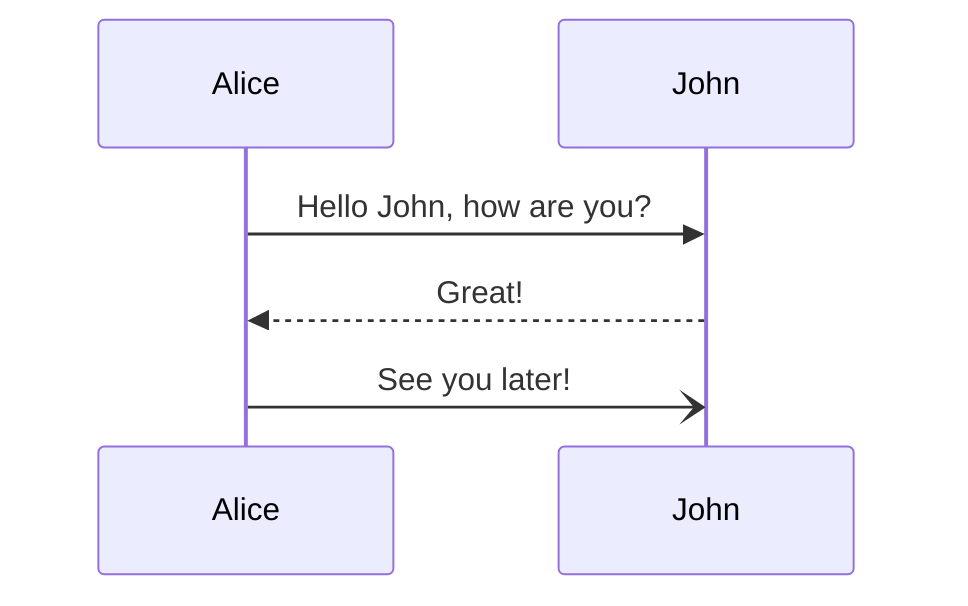

+++
title = "Bringup up Backstage (with Docker Compose)"
author = ["Rod Morison"]
date = 2023-01-01T19:22:00-08:00
draft = false
topics = ["Backstage", "Software architecture", "Docker"]
description = "How to host a backstage.io instance with Docker compose"
+++

## Backstage (for people in a hurry) {#backstage--for-people-in-a-hurry}


### Motivation {#motivation}

This how-to covers a relatively lightweight hosting for [Backstage](https://backstage.io/), Spotify's open source developer portal.


Many of the challenges that emerge as an engineering team scales--from 5 to 15, then 15 to 50, just about every factor of 2 or 3--can be traced back to something that could have been done better in a previous stage. Those challenges include documentation, architecture, code layout, and, CI/CD practice, to name a few. As deficiencies in these are identified in past work they get lumped into the [tech debt](https://en.wikipedia.org/wiki/Technical_debt) basket.

Does Backstage really help promote good engineering and beat back tech debt before it happens? I'm still at an experimental, proof of concept stage with Backstage, and hope to tackle that question in future articles.


### The Problem {#the-problem}

The [Backstage docs](https://backstage.io/docs/overview/what-is-backstage) are extensive, but hard to follow. Those docs jump back and forth between local configuration, plugin setups, plugin options, deployment suggestions, and more. I characterize the Backstage docs as everything, everywhere, all over the place! Maybe it's just me?

Yes, there's a [Backstage demo site](https://demo.backstage.io/catalog?filters%5Bkind%5D=component&filters%5Buser%5D=owned) for a quick look. The [Backstage getting started](https://backstage.io/docs/getting-started/) section walks through bringing up a site locally. But collaboration is what Backstage is all about; I need a shared instance to really kick the tires. (There are excellent hosted service options, such as [Roadie](https://roadie.io/), if you have the budget.)

So, what if you want to bring up Backstage for a small team, open source project, or a hackathon? I could not find a quick and easy setup for Backstage, something with modest effort before a `docker compose up` brings joy. The [Backstage Deployment](https://backstage.io/docs/deployment/) docs amount to helpful, but incomplete notes for bringing up a shared instance.


## Scope {#scope}

This document walks through a Docker Compose setup for Backstage with its core features:  [TechDocs](https://backstage.io/docs/features/techdocs/techdocs-overview), [Software Catalog](https://backstage.io/docs/features/software-catalog/software-catalog-overview), and [Software Templates](https://backstage.io/docs/features/software-templates/software-templates-index). In particular, the only infrastructure assumption is a publicly accessible, Docker ready server (AWS EC2, Digital Ocean, bare metal, etc.).

In this setup there is no TechDocs reliance on cloud storage; TechDocs will be stored in a shared Docker volume and published from a CI workflow, analogous to [Backstage's cloud storage](https://backstage.io/docs/features/techdocs/configuring-ci-cd) recommended practice.


## Tl;Dr {#tl-dr}

If you're _really_ in a hurry and already familiar with building Backstage, head over to my [backstage-docker](https://github.com/rmorison/backstage-docker) repo. You can likely stitch things together from the minimal docs there.


## What You'll Need {#what-you-ll-need}

-   A GitHub account or organization
-   A server with [Docker installed](https://docs.docker.com/engine/install/)
-   A local "developer" system


## Step by step {#step-by-step}

We'll walk through creating a new backstage app repository, configuring it for this setup, setting up CI/CD to build the app, the server hosting, and end with publishing CI for TechDocs.


### Prerequisites {#prerequisites}

Install and configure all of the tools for local backstage dev, per the [Backstage prerequisites](https://backstage.io/docs/getting-started/#prerequisites).


### Create your app {#create-your-app}

We'll call our app `backstage-app`. In a shell, `cd` to where you'd like to setup this project, and

```shell
npx @backstage/create-app
```

and at the `Enter a name for the app [required]` prompt, enter `backstage-app` (or another name of your choosing).

And with that, we have an app ready to run locally with `yarn dev`. Developing on the local instance is covered in the [Getting Started, configuring Backstage](https://backstage.io/docs/getting-started/configuration) section. You can check your build and run locally with

```shell
cd backstage-app
yarn dev
```

This article doesn't cover developing for Backstage or [Backstage plugins](https://backstage.io/docs/plugins/create-a-plugin). We'll move on to production configuration, CI/CD, and hosting.


### Create Repo and Push {#create-repo-and-push}

This guide uses GitHub Actions for CI. Create a new repo for `backstage-app` with an individual or organization owner. No need for any perfunctory files (README, .gitignore, license), as we'll push our app into this repo.



Setup the remote in your local `backstage-app` repo and push the initial commit (from the create-app script):

```shell
git remote add origin git@github.com:your-name-here/backstage-app.git
git branch -M main
git push -u origin main
```


#### Make sure `yarn.lock` is updated {#make-sure-yarn-dot-lock-is-updated}

Backstage starts with an empty `yarn.lock` file. (If you ran `yarn dev` you probably filled this in.) Update and commit that file.

```shell
yarn build:all
git add yarn.lock
git commit -m 'lock js packages'
```


### Docker Image CI {#docker-image-ci}

With our repo up, we can setup a Docker image CI. Backstage ships with a Dockerfile we'll use in `packages/backend/Dockerfile`. Note the `CMD` at the end of the Dockerfile.

```shell
CMD ["node", "packages/backend", "--config", "app-config.yaml", "--config", "app-config.production.yaml"]
```

Backstage will configure from `app-config.yaml` first and `app-config.production.yaml` second, the latter taking precedence. We'll edit `app-config.production.yaml` for our hosting.

But first, let's setup CI. We'll borrow from the [Backstage repo GitHub action](https://github.com/backstage/backstage/blob/master/.github/workflows/deploy_docker-image.yml), with some changes...

-   remove yarn caching
-   change the `on:` section to build on push to `main` branch or via [workflow_dispatch](https://docs.github.com/en/actions/using-workflows/events-that-trigger-workflows#workflow_dispatch) (so we can trigger a build on a feature branch)
-   build in `.` rather than `./example-app`

Create `.github/workflows/deploy_docker-image.yaml`, copying from [deploy_docker-image.yaml](https://github.com/rmorison/backstage-app/blob/main/.github/workflows/deploy_docker-image.yaml).

Add to the repo and push

```shell
git add .github/workflows/deploy_docker-image.yaml
git commit -m 'Workflow: Build and push Docker image'
git push
```

That should kick off a build.


After 4-5 minutes you should see the workflow complete and can visit repo packages (look for the Packages section in the repo home screen):


### App Config {#app-config}

Make the following config changes in `app-config.production.yaml`.


#### Edit `app` and `organization` {#edit-app-and-organization}

In the `app` seciton set `title` to  `${BACKSTAGE_APP_TITLE}` env var and `baseUrl` to `https://${BACKSTAGE_DOMAIN}`.

In the `organization` section set `name` to `${BACKSTAGE_ORGANIZATION_NAME}`.

These will be configured from Docker Compose environment settings.

```yaml
app:
  title: ${BACKSTAGE_APP_TITLE}
  baseUrl: https://${BACKSTAGE_DOMAIN}

organization:
  name: ${BACKSTAGE_ORGANIZATION_NAME}
```


#### Edit `backend` {#edit-backend}

Change the `backend` `baseUrl` and `listen` sections as follows, leaving the `database` section as is

```yaml
backend:
  baseUrl: https://${BACKSTAGE_DOMAIN}
  listen:
    port: '7007'
    host: '0.0.0.0'

  database:
    client: pg
    connection:
      host: ${POSTGRES_HOST}
      port: ${POSTGRES_PORT}
      user: ${POSTGRES_USER}
      password: ${POSTGRES_PASSWORD}
```


#### Edit `catalog` {#edit-catalog}

Replace the `catalog` section with

```yaml
catalog:
  import:
    entityFilename: catalog-info.yaml
    pullRequestBranchName: backstage-integration
  rules:
    - allow: [Component, System, API, Resource, Location, Template, User, Group]
```

Later, you may want to come back and add standard locations for some entity types, Users and Groups for example. But keep it simple for now, until the system is up and running.


#### Edit `techdocs` {#edit-techdocs}

[TechDocs](https://backstage.io/docs/features/techdocs/techdocs-overview) is Backstage's "docs as code" framework. TechDocs Markdown documents under a repository's `docs` tree and publishes it to a browsable, searchable documentation site. We'll setup CI/CD per the [TechDocs recommended deployment](https://backstage.io/docs/features/techdocs/architecture#recommended-deployment), except that the publish step will be replaced by secure copy to a volume in the Backstage Docker cluster, instead of cloud storage.

That means the `techdocs` section `builder` should be set to `external`. The `publisher` section needs to point at a local directory path. Append the following to `app-config.production.yaml`

```yaml
techdocs:
  builder: 'external'
  publisher:
    type: 'local'
    local:
      publishDirectory: ${TECHDOCS_DIR}
```

We'll setup a TechDocs publish action later.


#### Commit and Push {#commit-and-push}

That's our production config. Your config should look like [app-config.production.yaml](https://github.com/rmorison/backstage-app/blob/main/app-config.production.yaml); when you're ready, add, commit, and push.

```shell
git add app-config.production.yaml
git commit -m "Production app config"
git push
```

The "Build and push Docker image" action should trigger, check when done for status.


### Update Backstage Catalog, Setup TechDocs {#update-backstage-catalog-setup-techdocs}


#### Update `catalog-info.yaml` {#update-catalog-info-dot-yaml}

The app was created with a scaffolded `catalog-info.yaml`, which needs some edits. We'll also add TechDocs support and a simple doc to validate the build.

In the `metadata` section, change `description` to your repo description (or whatever you like).

Uncomment the `annotations` section. Change the `github.com/project-slug` to your repo path (minus the github.com part) and leave `backstage.io/techdocs-ref` as is (`dir:.`).

Under `spec` change `owner` to your Github id (recommended) or email. You can change this once you settle on an identity scheme, which is a topic for another day.

Your `catalog-info.yaml` should look like

```yaml
apiVersion: backstage.io/v1alpha1
kind: Component
metadata:
  name: backstage-app
  description: My Backstage application.
  annotations:
    github.com/project-slug: my-github-id/backstage-app
    backstage.io/techdocs-ref: dir:.
spec:
  type: website
  owner: my-github-id
  lifecycle: experimental
```


#### Setup TechDocs {#setup-techdocs}

In addition to the `backstage.io/techdocs-ref: dir:.` in `catalog-info.yaml`, TechDocs requires a `mkdocs.yml`. Add that file to the top of your repo with the following

```yaml
site_name: 'backstage-app'

nav:
  - Home: index.md

plugins:
  - techdocs-core

markdown_extensions:
  - markdown_inline_mermaid
```

Add some documentation, create `docs/index.md` with

````markdown
# Hello World!


````


#### Commit and Push {#commit-and-push}

````shell
git add catalog-info.yaml mkdocs.yml docs
git commit -m "Update catalog-info, add TechDocs"
git push
````


### Docker Compose Setup {#docker-compose-setup}

With our Docker image built, time to get it running on a server. We'll use the `docker-compose.yml` I've built in the [backstage-docker repo](https://github.com/rmorison/backstage-docker). The configuration instructions are documented there, so we'll just mimic the [Step by Step](https://github.com/rmorison/backstage-docker#step-by-step) here. Be sure to review [env setup](https://github.com/rmorison/backstage-docker#env-docs) carefully, most problems trace back to a setting in that file.

On your server

````shell
git clone https://github.com/rmorison/backstage-docker.git
cd backstage-docker
cp sample.env .env
vi .env
sudo apt install --yes apache2-utils
htpasswd -bn backstage change-this-password >>.htpasswd
````

Before you bring up your server, be sure to point a domain name at your server's public IP address. The Let's Encrypt ssl cert validation will fail if you don't.

With that done,

````shell
docker compose up --build
````

and try accessing your new server from a browser.

Test your new backstage by adding the backstage-app component: hit "Create...", then "REGISTER EXISTING COMPONENT", then enter the url to your `catalog-info.yaml` file.


If all is good, you should have a registered backstage component, like


However, if you click on the "VIEW TECHDOCS" link, you'll get an error.


Adding our component doesn't automatically publish its TechDocs, since we've chosen an external builder (in `app-config.production.yaml`), so that's on us.

Next, we'll setup a Github Action to publish to our compose cluster.


### TechDocs Publish CI {#techdocs-publish-ci}

The external builder setting in `app-config.production.yaml` is the Backstage recommended practice. But that means each repo with TechDocs needs a publish CI setup. We'll create a `techdocs.yaml` workflow, fashioned after [Example: GitHub Actions CI and AWS S3](https://backstage.io/docs/features/techdocs/configuring-ci-cd#example-github-actions-ci-and-aws-s3). We'll replace AWS S3 storage with an `scp` and swap out the PlantUML support, in favor of [MermaidJS](https://mermaid.js.org/#/). (Mermaid is a diagramming tool that is also [supported in Github Markdown rendering](https://github.blog/2022-02-14-include-diagrams-markdown-files-mermaid/).) Note that Backstage's [How to add Mermaid support in TechDocs](https://backstage.io/docs/features/techdocs/how-to-guides#how-to-add-mermaid-support-in-techdocs) procedure uses a separate [Kroki](https://kroki.io/) server, which we don't follow here, favoring a simpler "full static" approach.

Create `.github/workflows/techdocs.yaml`, and copy in the contents of this [techdocs.yaml](https://github.com/rmorison/backstage-app/blob/main/.github/workflows/techdocs.yaml).

The one workflow step to note---and the most common source of errors---is the "Publish docs site via scp" step. The Docker cluster has a SSH service running on port 2222, which needs to be open on the firewall to your server. That SSH service can write to the Docker volume where Backstage looks for TechDocs, if you recall the `techdocs` section of our config. (That OpenSSH server is configured [here](https://github.com/rmorison/backstage-docker/blob/main/docker-compose.yml#L62) in the compose file, in case you're looking.)

````yaml
- name: Publish docs site via scp
  uses: appleboy/scp-action@master
  with:
    host: ${{ secrets.TECHDOCS_HOST }}
    key: ${{ secrets.TECHDOCS_SSH_PRIVATE_KEY }}
    username: techdocs
    port: 2222
    source: site
    target: /techdocs/${{ env.ENTITY_NAMESPACE }}/${{ env.ENTITY_KIND }}/${{ env.ENTITY_NAME }}
    strip_components: 1
    rm: true
````

Note the two secrets. These go in your Github repo action secrets. `TECHDOCS_HOST` is the domain name pointing at your server.

If you followed the [TechDocs Publish SSH Keypair](https://github.com/rmorison/backstage-docker#techdocs-publish-ssh-keypair) section you already have the private key. (If not, do that now, and update your `.env` with the **public** key, restart your cluster.) The `TECHDOCS_SSH_PRIVATE_KEY` in your repo actions secrets gets the contents of the private key file, `techdocs_rsa`.

And finally, note `target:`. This value has to be just right for Backstage to find TechDocs. In particular, `ENTITY_KIND` must be lower case, which you'll see a previous action step for.

With that, commit, push, watch the action run, and try "VIEW TECHDOCS" again.

````shell
git add .github/workflows/techdocs.yaml
git commit -m 'Workflow: Publish docs site via scp'
git push
````

If all goes well...


If not, it's time to debug.


## Are we done yet? {#are-we-done-yet}

Backstage absolutely has a cost of ownership. The goal of this article is to make quick self hosting palatable for small projects and teams. If a Backstage adoption is successful and the team or scope grows, maintaining and evolving Backstage is a full time job. Again, there are excellent hosted versions, like [Roadie](https://roadie.io/), if you have a budget.

Is the value proposition worth it? That's a topic for another day.


## Pulling a New Backstage Build {#pulling-a-new-backstage-build}

Standard Docker stuff, but for reference

````shell
docker compose stop backstage \
    && docker compose rm -f backstage \
    && docker compose pull backstage \
    && docker compose up -d backstage
docker compose logs -f backstage
````


## Questions or Issues? {#questions-or-issues}

Post in [backstage-app discussions](https://github.com/rmorison/backstage-app/discussions) or [backstage-docker discussions](https://github.com/rmorison/backstage-docker/discussions).
