#+seq_todo: TODO NEXT IN-PROGRESS DONE
#+hugo_base_dir: ../
#+STARTUP: overview

* DONE How I Org, A Software Engineer's Process                        :productivity:personal_process:
CLOSED: [2022-08-10 Wed 20:56]
:PROPERTIES:
:EXPORT_FILE_NAME: how-i-org
:EXPORT_HUGO_CUSTOM_FRONT_MATTER: :topics '(Emacs "Org-mode")
:EXPORT_HUGO_CUSTOM_FRONT_MATTER+: :description "Emacs and Org-mode to track work, improve flow, and reduce (cognitive) stress"
:EXPORT_HUGO_CUSTOM_FRONT_MATTER+: :images '("https://rm.rmdashrf.net/ox-hugo/task-state-cover.png")
:END:
:LOGBOOK:
- State "DONE"       from "TODO"       [2022-08-10 Wed 20:56]
:END:

** How I Org
I've encountered a half dozen or so personal productivity, task management, organization and motivation systems. (I will spare the list.) The latest I've read is David Allen's [[https://gettingthingsdone.com/][Getting Things Done]]. Having been there and done this, I read Allen's book with a "Just take me to the algorithm" mentality.

Also, I create software for living. Software development is an occupation that is both creative and technical. It's also a craft that is mostly performed at a computer and is now more virtual than ever. A lot of text in /Getting Things Done/ covers tools and techniques that support the algorithm, but are incidental: there are many ways to implement, track, and execute Allen's techniques. A salesperson's needs here are different than a manager's, are different than a software engineer's, and so on.

My own personal organization needs are nearly full-virtual. Either I'm in a virtual meeting, preparing for one, working on tasks from one, or---and what I do best---designing and writing code and building software products. And finally, I spend as much time as possible in the Emacs editor. There are many, many code editors and IDEs out there.  Yet once you've paid the admittedly steep learning curve for Emacs, it's the most effective "flow tool" I know of. What I do in Emacs, including this very text, I can get lost in, which means maximum productivity.

By the way, I do not mash up personal todos with my work as GTD encourages. I prefer a simpler in->due?->done for this part of my life. For personal work I use [[https://todoist.com/][Todoist]] for it's clean UX, mobile app, and sync across devices. Todoist recently added [[https://todoist.com/kanban-board][Kanban boards,]] so I may toy with a GTD-esque flow sans Emacs (which is a fiddly challenge to sync across devices.) That notwithstanding, I'll continue with my Emacs setup.

*** Why Emacs?
I admit, I've got years of Emacs key bindings in my fingers. But like playing the piano, practice makes plenty good. More keyboard, less mousing around many windows lends to good flow. I can now capture meeting notes, reference tidbits, fleeting ideas, and so on, with confidence I can forget them now, find them later, and fold follow ups into todo lists and projects plans.

*** References
The following works were highly influential in my own productivity thinking and, of course, this article. 
- [[https://gettingthingsdone.com/][Getting Things Done]] by David Allen: This highly popular "work of the day" got me re-thinking about personal productivity again, and tweaking some of my own practice as a result.
- [[https://www.researchgate.net/publication/222552899_Getting_Things_Done_The_Science_Behind_Stress-Free_Productivity][Getting Things Done: The Science Behind Stress-Free Productivity]] by Francis Heylighen and Clément Vidal: An academic paper on GTD that lays a foundation for what I think is the biggest return on investment for GTD: reducing cognitive stress and overload. No less important, the authors provide an extremely concise and on-point summary of Allen's method, including a comprehensive (wait for it) [[https://www.researchgate.net/profile/Francis-Heylighen/publication/222552899/figure/fig1/AS:304772235186176@1449674771358/a-flowchart-depicting-the-GTD-process-for-organizing-and-processing-incoming-stuff.png][flowchart of the algorithm]]! Recommended reading.
- [[https://www.edwardslingerland.com/trying-not-to-try][Trying Not To Try]] by Edward Slingerland: This trade book is very thought provoking if you have interest in the convergence of history, culture, religion, and creativity. Of most relevance here is the connection to "flow state". Every section of Slingerland's book got me thinking about my own creativity, workplace and historical bias, and where I fit on the spectrum between Confucius and Laozi. /Wu-wei/ ftw!
- [[https://www.youtube.com/watch?v=VcgjTEa0kU4][Org Mode Basics]] and [[https://www.youtube.com/watch?v=PNE-mgkZ6HM][Organize Your Life with Org Mode]] (videos): [[https://systemcrafters.cc/][System Crafters]] is a great source of live code videos and one of the best ways to get into Emacs.

** Emacs Config
If you're interested in my detailed Emacs config, i.e., ~init.el~ you can find my setup in my [[https://github.com/rmorison/dotfiles][GitHub dotfiles repo]]. My Org-mode config started with [[https://www.youtube.com/watch?v=PNE-mgkZ6HM][Organize Your Life with Org Mode]]. If you're new to Emacs or Org-mode, start there.
  
** A Walk-through
The rest of this doc is a walk-through with animated GIFs to illustrate.

*** It All Starts with a Meeting
Let's start with a meeting, which was my original use-case. Alt-tab to Emacs, then ~C-c c m~ to open an entry in ~meetings.org~ from the [[https://github.com/rmorison/dotfiles/blob/main/org/templates/meeting.org][meeting template]]. The template will ask who the meeting is with and what it's about. (There's also a 1-on-1 meeting template, with just the "who?" question, ~C-c c 1~.)

#+CAPTION: Fave Music meeting with Lunis and Lucy


When the meeting is over and I'm ready to finish the capture I'd normally hit ~C-c C-c~. Instead, I'll use ~C-u C-u C-c C-c~ to /follow/ the capture buffer into the filed location in ~meetings.org~. I'll add a ~TODO~ manually, without a template, by typing ~M-enter~ to open a new outline node and then ~TODO Learn Für Elise on piano~. Text files ftw!

#+CAPTION: File the meeting, create a task 


*** Check the Backlog, Schedule the Task
~C-c a a~ brings up my agenda for the week. It's empty right now, nothing scheduled. ~C-c a b~ brings up my backlog view. I'll I see the "Learn Für Elise on piano" todo. Using GTD practice, I can either do this right away (2m rule, iirc) and make it DONE, move it to NEXT state, or realize it's too big for a single task and break it up.
#+CAPTION Agenda check


*** My Algorithm
Now's a good time to highlight the tasks states I use and my typical path through them.
#+begin_src mermaid :file img/task-state-cover.png
stateDiagram-v2
BREAKDOWN: BREAKDOWN-PLAN
INPROGRESS: IN-PROGRESS
HELDBLOCKED: HELD-BLOCKED
WONTDO: WONT-DO
WONTDOPROJECT: WONT-DO
state if_project <<choice>>
state getter_done <<choice>>
state last_mile <<choice>>
state plan_project <<choice>>
[*] --> TODO
TODO --> if_project
if_project --> NEXT: sized and timely
if_project --> BREAKDOWN: too bigga eat
if_project --> WONTDO: not happening
state BREAKDOWN {
  plan_project --> PLANNED: create project tasks
  plan_project --> WONTDOPROJECT: abandon project
  PLANNED --> [*]
  WONTDOPROJECT --> [*]
}
NEXT --> getter_done
getter_done --> INPROGRESS: it's alive!
getter_done --> DELEGATED: tracking
getter_done --> WONTDO: thought so, but no
INPROGRESS --> last_mile
last_mile --> DONE: yay!
last_mile --> WONTDO: changed my mind
last_mile --> HELDBLOCKED: blocked
HELDBLOCKED --> INPROGRESS: unblocked
HELDBLOCKED --> WONTDO: give up
DONE --> [*]
WONTDO --> [*]
#+end_src

#+RESULTS:
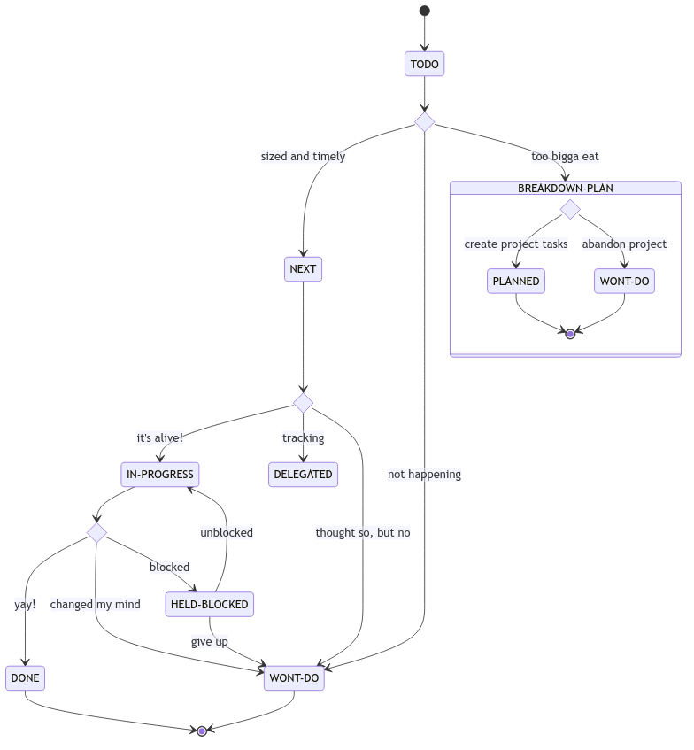

*** Review Backlog, Schedule Work
~C-c a b~ into my backlog view, I realize my task is a project, too big on its own. (I try to visit the backlog at least once a day.) I'm going to set the task to ~BREAKDOWN-PLAN~. (For example, I have to get a keyboard, buy the sheet music, hire a music teacher) and schedule the planning work for tomorrow.

In the backlog view cursor to the "~TODO~ Learn Für Elise on piano", use ~C-c C-t~ and choose the new state with ~b~. Then, ~C-c C-s~ brings up the calendar. ~S-→~ navigates the calendar. I'll finish with ~C-c a a~ to double check my agenda.


*** Check Agenda, Plan Project
Later, I'll check my agenda, ~C-c a a~, arrow down to the ~BREAKDOWN-PLAN~ task, hit ~ENTER~ to jump to the task. I'll drop ~TODO~ entries right under that in the outline. I'll change that ~BREAKDOWN-PLAN~ state to ~PLANNED~, then ~C-x C-s~ to save.


*** Refile Into Projects File, Set Deadlines, Tee up Tasks
Refile is the gem of Org-mode. I don't want to track and annotate my project in my meetings folder, that's not the way. I'm going to move the whole project outline to my projects folder.

~C-x C-f meetings.org~ to open my meetings file, arrow to the ~PLANNED~ project, and ~C-c C-w~ to invoke Org-mode refile. 


*** Prep and Schedule my Backlog
Next, I'll set deadlines and move tasks to ~NEXT~ state. ~C-c a b~ to the backlog, ~C-c C-t n~ for ~NEXT~ state and ~C-c C-d~ to set deadlines, ~C-c C-s~ for scheduled dates. Then I hand edit the "Practice Weekly" task scheduled date for a 1 week [[https://orgmode.org/manual/Repeated-tasks.html][repeated task]]. (Either you love text files, or you don't.)


*** Add Reference Note, Link it in Project
Finally I'll take some historical notes about Für Elise and put a link to those notes into the project outline. I open a reference note with ~C-c c n~ and save it with ~C-u C-u C-c C-c~. The template asks for a title, then I can tap in text. I've bound ~C-c l~ to save an "anchor link" at the current point, and can then open ~projects.org~ and use ~C-c C-l~ to paste it in.


** Features, Features, and more Features
Emacs Org-mode has a dizzying array of [[https://orgmode.org/features.html][features]] and this walk-through is only meant to capture the essence of how I org. I don't use all of these, but for reference, here goes...
- [[https://orgmode.org/manual/Tags.html][Tags]]
- [[https://orgmode.org/manual/Tracking-your-habits.html][Habits]]
- [[https://orgmode.org/manual/Clocking-Work-Time.html][Time tracking]]
- [[https://orgmode.org/worg/org-contrib/babel/][Executing code blocks (Babel)]]
- [[https://orgmode.org/manual/Exporting.html][Exporting]] (say, to markdown or HTML) and [[https://orgmode.org/manual/Publishing.html][publishing]]
- [[https://orgmode.org/worg/org-blog-wiki.html][Blogging and content sites]]

And of course, we're talking Emacs here. If you can code it in Elisp, you can do it.

* DONE Sprint 0.5: Planning a New Service Build
CLOSED: [2022-08-27 Sat 01:06]
:PROPERTIES:
:EXPORT_FILE_NAME: sprint-zero-point-five
:EXPORT_HUGO_CUSTOM_FRONT_MATTER: :topics '("Software architecture" "Project management")
:EXPORT_HUGO_CUSTOM_FRONT_MATTER+: :description "Sprint 0.5: uncovering the hidden work in a new service build"
:EXPORT_HUGO_ALIASES: sprint-0
:END:

** The Sprint 0.5 Scenario
I often come across new, [[https://en.wikipedia.org/wiki/Greenfield_project][greenfield]] backend projects or [[https://en.wikipedia.org/wiki/Brownfield_(software_development)][brownfield]] rewrites of an existing service (usually a monolith) into a new service architecture (usually microservice), and a new infrastructure (cloud migration). It's common---and a best practice---to kick off such a project with a [[https://en.wikipedia.org/wiki/Application_discovery_and_understanding][discovery phase]], unless product requirements are already developed and well understood by the implementation team. The discovery phase is sometime called "Sprint 0", though it's often a much bigger time and effort investment than a common development sprint.

It's also common to invest in some technical architecture and project planning during that discovery sprint. What I've observed in some projects is the technical planning in discovery is just enough for a modicum of work breakdown and estimation. Discovery typically delivers just enough design documentation for feature build tickets or story tasks. However, and especially for a greenfield build, all that planning leaves a host of implementation questions hanging.

Are we set on language, libraries, and web stack? Have we agreed on code formatters, linters, static checkers? What are we using for CI/CD? Do we have a devops plan, to write infrastructure code and bring up multiple environments? And so on.

Sometimes, when an experienced team implements in a familiar organization with established practices, these questions are mostly answered. More often, work such as this creates huge friction in the early sprints and divergence across teams working on different services. And even for the ready-to-roll team, it's worth going through a checklist, look for upgrade opportunities.

The pressure to, "Get going with delivery", can be heavy.  But resist!…if there's a load of these non-recurring tasks hanging unresolved. Get them scheduled in, with full visibility.

I call this /Sprint 0.5/ work: [[https://en.wikipedia.org/wiki/Non-recurring_engineering][NRE]] that has to be done, is better done at the beginning, and creates friction, disorganization, and divergence complexity of not done up front.

** Refine the Architecture, Revisit the Plan
When discovery phase technical architecture, planning and estimation is done, I believe it's worth coming back to at the end of Sprint 0.5. The team has a lot more "feel" for the implementation at this point and is likely to do a deeper dive into tickets and more accurate estimates.

Or, better yet, only do the top level architecture and project breakdown, with minimal [[https://asana.com/resources/t-shirt-sizing][t-shirt size]] accuracy estimation during discovery. Save the deep dive until the tech work of Sprint 0.5 is done.

Of course, commitment to stakeholders, budget and deadline pressure may make this untenable. But at least validate your discovery project plan and estimates. And if Sprint 0.5 estimates are significantly greater than those from discovery, well that's another problem.
[[./img/brown_and_black_turtle_on_brown_sand-scopio-01f822e0-47d5-4952-b881-2331aa99c598.jpg]]

** Sprint 0.5 Project Breakdown
Here I offer a canonical work breakdown for a sprint 0.5. The epics breakdown are part of a more detailed breakdown in this [[https://docs.google.com/spreadsheets/d/1VmFfYiROtW4wktL4Exlz9NODEgOy4tTJb9lJS5lP9EE/edit?usp=sharing][Sprint 0.5 project breakdown]] Google sheet.

+---------------------------+----------------------------------------------------------------+
|Epic                       |Tasks                                                           |
+---------------------------+----------------------------------------------------------------+
|Service stack template(s)  |Select language, libraries, web stack for service and serverless|
|                           |implementations; build out a "cookiecutter" template project;   |
|                           |add standardized test runner, coverage, linters, static         |
|                           |checkers, and formatters.                                       |
+---------------------------+----------------------------------------------------------------+
|Continuous integration (CI)|Decide on CI (Jenkins, GH Actions, BB Pipelines, Travis,        |
|                           |CircleCI); setup servers and/or runners; containerize template  |
|                           |service(s); add test, lint, format to CI; add Dockerfile, CI to |
|                           |templates                                                       |
+---------------------------+----------------------------------------------------------------+
|Cloud infrastructure       |Build an environment in infrastructure with template service(s):|
|                           |container strategy (orchestration, etc), networking, databases, |
|                           |proxies, load balancers; implement with infrastructure code and |
|                           |validate with env spinup                                        |
+---------------------------+----------------------------------------------------------------+
|Continuous deployment (CD) |Establish branch/release/env SDLC strategy; connect service     |
|                           |builds with env deploys                                         |
+---------------------------+----------------------------------------------------------------+
|Logging & monitoring       |Setup logging, APM, trace in service stack and feed to central  |
|                           |logging; setup service health checks; add anomaly alerting      |
|                           |(Slack, SMS, Pagerduty)                                         |
+---------------------------+----------------------------------------------------------------+
|Service architecture       |Design entities, APIs, async tasks, etc. for initial set of     |
|                           |services, including registration/authentication                 |
+---------------------------+----------------------------------------------------------------+
|Planning & estimating      |Use architecture level design for implementation stories,       |
|                           |estimates, and scheduling                                       |
+---------------------------+----------------------------------------------------------------+
|Initial build: sprint 1,2,…|At this point each service can drop a code template with CI/CD  |
|                           |ready to go and start a sequence of delivery sprints            |
+---------------------------+----------------------------------------------------------------+

** A Sprint 0.5 Gantt Chart
As a practical matter of efficiency, much of Sprint 0.5 can be split among software architects, developers, and devops staff, allowing work in parallel, as suggested below.

#+begin_src mermaid :file img/sprint-0.5-gantt.png
gantt
    title Sprint 0.5 Project Plan
    dateFormat DD
    axisFormat %d
    section Discovery
    Discovery           :discovery, 01, 2d
    section Sprint 0.5
    Service stack template(s) :templates, after discovery, 1d
    Continuous integration (CI) :ci, after templates, 1d
    Cloud infrastructure :infra, after discovery, 2d
    Continuous deployment (CD) :cd, after infra, 1d
    Logging & monitoring :logging, after cd, 1d
    Service architecture :arch, after ci, 1d
    Planning & estimating :planning, after arch, 1d
    Sprint 0.5 complete :milestone, after planning
    section Delivery
    Sprint 1 :sprint1, after planning, 1d
    Sprint 2 :sprint2, after sprint1, 1d
#+end_src

* DONE Bringup up Backstage (with Docker Compose)
CLOSED: [2023-01-01 Sun 19:22]
:PROPERTIES:
:EXPORT_FILE_NAME: bringing-up-backstage
:EXPORT_HUGO_CUSTOM_FRONT_MATTER: :topics '("Backstage" "Software architecture" "Docker")
:EXPORT_HUGO_CUSTOM_FRONT_MATTER+: :description "How to host a backstage.io instance with Docker compose"
:END:
** Backstage (for people in a hurry)
*** Motivation
This how-to covers a relatively lightweight hosting for [[https://backstage.io/][Backstage]], Spotify's open source developer portal.


Many of the challenges that emerge as an engineering team scales--from 5 to 15, then 15 to 50, just about every factor of 2 or 3--can be traced back to something that could have been done better in a previous stage. Those challenges include documentation, architecture, code layout, and, CI/CD practice, to name a few. As deficiencies in these are identified in past work they get lumped into the [[https://en.wikipedia.org/wiki/Technical_debt][tech debt]] basket.

Does Backstage really help promote good engineering and beat back tech debt before it happens? I'm still at an experimental, proof of concept stage with Backstage, and hope to tackle that question in future articles.
*** The Problem
The [[https://backstage.io/docs/overview/what-is-backstage][Backstage docs]] are extensive, but hard to follow. Those docs jump back and forth between local configuration, plugin setups, plugin options, deployment suggestions, and more. I characterize the Backstage docs as everything, everywhere, all over the place! Maybe it's just me?

Yes, there's a [[https://demo.backstage.io/catalog?filters%5Bkind%5D=component&filters%5Buser%5D=owned][Backstage demo site]] for a quick look. The [[https://backstage.io/docs/getting-started/][Backstage getting started]] section walks through bringing up a site locally. But collaboration is what Backstage is all about; I need a shared instance to really kick the tires. (There are excellent hosted service options, such as [[https://roadie.io/][Roadie]], if you have the budget.)

So, what if you want to bring up Backstage for a small team, open source project, or a hackathon? I could not find a quick and easy setup for Backstage, something with modest effort before a =docker compose up= brings joy. The [[https://backstage.io/docs/deployment/][Backstage Deployment]] docs amount to helpful, but incomplete notes for bringing up a shared instance.
** Scope
This document walks through a Docker Compose setup for Backstage with its core features:  [[https://backstage.io/docs/features/techdocs/techdocs-overview][TechDocs]], [[https://backstage.io/docs/features/software-catalog/software-catalog-overview][Software Catalog]], and [[https://backstage.io/docs/features/software-templates/software-templates-index][Software Templates]]. In particular, the only infrastructure assumption is a publicly accessible, Docker ready server (AWS EC2, Digital Ocean, bare metal, etc.).

In this setup there is no TechDocs reliance on cloud storage; TechDocs will be stored in a shared Docker volume and published from a CI workflow, analogous to [[https://backstage.io/docs/features/techdocs/configuring-ci-cd][Backstage's cloud storage]] recommended practice.
** Tl;Dr
If you're /really/ in a hurry and already familiar with building Backstage, head over to my [[https://github.com/rmorison/backstage-docker][backstage-docker]] repo. You can likely stitch things together from the minimal docs there.
** What You'll Need
- A GitHub account or organization
- A server with [[https://docs.docker.com/engine/install/][Docker installed]]
- A local "developer" system 
** Step by step
We'll walk through creating a new backstage app repository, configuring it for this setup, setting up CI/CD to build the app, the server hosting, and end with publishing CI for TechDocs.
*** Prerequisites
Install and configure all of the tools for local backstage dev, per the [[https://backstage.io/docs/getting-started/#prerequisites][Backstage prerequisites]].
*** Create your app
We'll call our app ~backstage-app~. In a shell, ~cd~ to where you'd like to setup this project, and
#+begin_src shell
  npx @backstage/create-app
#+end_src
and at the ~Enter a name for the app [required]~ prompt, enter ~backstage-app~ (or another name of your choosing).

And with that, we have an app ready to run locally with ~yarn dev~. Developing on the local instance is covered in the [[https://backstage.io/docs/getting-started/configuration][Getting Started, configuring Backstage]] section. You can check your build and run locally with
#+begin_src shell
  cd backstage-app
  yarn dev
#+end_src

This article doesn't cover developing for Backstage or [[https://backstage.io/docs/plugins/create-a-plugin][Backstage plugins]]. We'll move on to production configuration, CI/CD, and hosting.
*** Create Repo and Push
This guide uses GitHub Actions for CI. Create a new repo for ~backstage-app~ with an individual or organization owner. No need for any perfunctory files (README, .gitignore, license), as we'll push our app into this repo.

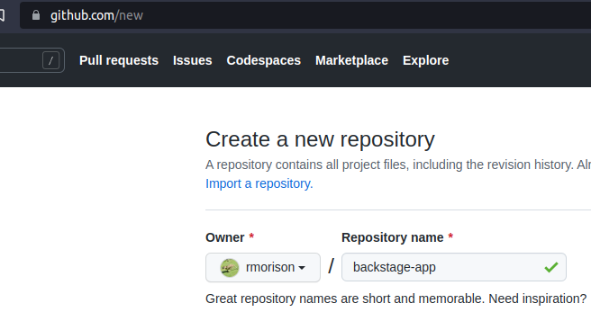

Setup the remote in your local ~backstage-app~ repo and push the initial commit (from the create-app script):
#+begin_src shell
  git remote add origin git@github.com:your-name-here/backstage-app.git
  git branch -M main
  git push -u origin main
#+end_src
**** Make sure ~yarn.lock~ is updated
Backstage starts with an empty ~yarn.lock~ file. (If you ran ~yarn dev~ you probably filled this in.) Update and commit that file.
#+begin_src shell
  yarn build:all
  git add yarn.lock
  git commit -m 'lock js packages'
#+end_src
*** Docker Image CI
With our repo up, we can setup a Docker image CI. Backstage ships with a Dockerfile we'll use in ~packages/backend/Dockerfile~. Note the ~CMD~ at the end of the Dockerfile.
#+begin_src shell
CMD ["node", "packages/backend", "--config", "app-config.yaml", "--config", "app-config.production.yaml"]
#+end_src

Backstage will configure from ~app-config.yaml~ first and ~app-config.production.yaml~ second, the latter taking precedence. We'll edit ~app-config.production.yaml~ for our hosting.

But first, let's setup CI. We'll borrow from the [[https://github.com/backstage/backstage/blob/master/.github/workflows/deploy_docker-image.yml][Backstage repo GitHub action]], with some changes...
- remove yarn caching
- change the ~on:~ section to build on push to ~main~ branch or via [[https://docs.github.com/en/actions/using-workflows/events-that-trigger-workflows#workflow_dispatch][workflow_dispatch]] (so we can trigger a build on a feature branch)
- build in ~.~ rather than ~./example-app~

Create ~.github/workflows/deploy_docker-image.yaml~, copying from [[https://github.com/rmorison/backstage-app/blob/main/.github/workflows/deploy_docker-image.yaml][deploy_docker-image.yaml]].

Add to the repo and push
#+begin_src shell
  git add .github/workflows/deploy_docker-image.yaml
  git commit -m 'Workflow: Build and push Docker image'
  git push
#+end_src

That should kick off a build.
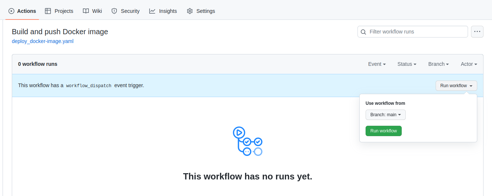

After 4-5 minutes you should see the workflow complete and can visit repo packages (look for the Packages section in the repo home screen):
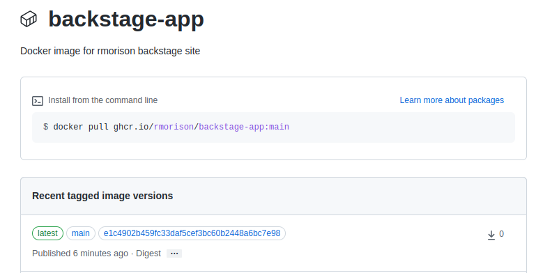

*** App Config
Make the following config changes in ~app-config.production.yaml~.

**** Edit ~app~ and ~organization~
In the ~app~ seciton set ~title~ to  ~${BACKSTAGE_APP_TITLE}~ env var and ~baseUrl~ to ~https://${BACKSTAGE_DOMAIN}~.

In the ~organization~ section set ~name~ to ~${BACKSTAGE_ORGANIZATION_NAME}~.

These will be configured from Docker Compose environment settings.
#+begin_src yaml
  app:
    title: ${BACKSTAGE_APP_TITLE}
    baseUrl: https://${BACKSTAGE_DOMAIN}

  organization:
    name: ${BACKSTAGE_ORGANIZATION_NAME}
#+end_src

**** Edit ~backend~
Change the ~backend~ ~baseUrl~ and ~listen~ sections as follows, leaving the ~database~ section as is
#+begin_src yaml
  backend:
    baseUrl: https://${BACKSTAGE_DOMAIN}
    listen:
      port: '7007'
      host: '0.0.0.0'

    database:
      client: pg
      connection:
        host: ${POSTGRES_HOST}
        port: ${POSTGRES_PORT}
        user: ${POSTGRES_USER}
        password: ${POSTGRES_PASSWORD}
#+end_src

**** Edit ~catalog~
Replace the ~catalog~ section with
#+begin_src yaml
catalog:
  import:
    entityFilename: catalog-info.yaml
    pullRequestBranchName: backstage-integration
  rules:
    - allow: [Component, System, API, Resource, Location, Template, User, Group]
#+end_src
Later, you may want to come back and add standard locations for some entity types, Users and Groups for example. But keep it simple for now, until the system is up and running.

**** Edit ~techdocs~
[[https://backstage.io/docs/features/techdocs/techdocs-overview][TechDocs]] is Backstage's "docs as code" framework. TechDocs Markdown documents under a repository's ~docs~ tree and publishes it to a browsable, searchable documentation site. We'll setup CI/CD per the [[https://backstage.io/docs/features/techdocs/architecture#recommended-deployment][TechDocs recommended deployment]], except that the publish step will be replaced by secure copy to a volume in the Backstage Docker cluster, instead of cloud storage.

That means the ~techdocs~ section ~builder~ should be set to ~external~. The ~publisher~ section needs to point at a local directory path. Append the following to ~app-config.production.yaml~
#+begin_src yaml
  techdocs:
    builder: 'external'
    publisher:
      type: 'local'
      local:
        publishDirectory: ${TECHDOCS_DIR}
#+end_src
We'll setup a TechDocs publish action later.

**** Commit and Push
That's our production config. Your config should look like [[https://github.com/rmorison/backstage-app/blob/main/app-config.production.yaml][app-config.production.yaml]]; when you're ready, add, commit, and push.
#+begin_src shell
  git add app-config.production.yaml
  git commit -m "Production app config"
  git push
#+end_src
The "Build and push Docker image" action should trigger, check when done for status.

*** Update Backstage Catalog, Setup TechDocs

**** Update ~catalog-info.yaml~
The app was created with a scaffolded ~catalog-info.yaml~, which needs some edits. We'll also add TechDocs support and a simple doc to validate the build.

In the ~metadata~ section, change ~description~ to your repo description (or whatever you like).

Uncomment the ~annotations~ section. Change the ~github.com/project-slug~ to your repo path (minus the github.com part) and leave ~backstage.io/techdocs-ref~ as is (~dir:.~).

Under ~spec~ change ~owner~ to your Github id (recommended) or email. You can change this once you settle on an identity scheme, which is a topic for another day.

Your ~catalog-info.yaml~ should look like
#+begin_src yaml
  apiVersion: backstage.io/v1alpha1
  kind: Component
  metadata:
    name: backstage-app
    description: My Backstage application.
    annotations:
      github.com/project-slug: my-github-id/backstage-app
      backstage.io/techdocs-ref: dir:.
  spec:
    type: website
    owner: my-github-id
    lifecycle: experimental
#+end_src

**** Setup TechDocs
In addition to the ~backstage.io/techdocs-ref: dir:.~ in ~catalog-info.yaml~, TechDocs requires a ~mkdocs.yml~. Add that file to the top of your repo with the following
#+begin_src yaml
  site_name: 'backstage-app'

  nav:
    - Home: index.md

  plugins:
    - techdocs-core

  markdown_extensions:
    - markdown_inline_mermaid
#+end_src

Add some documentation, create ~docs/index.md~ with
#+begin_src markdown
  # Hello World!

  ```mermaid
  sequenceDiagram
      Alice->>John: Hello John, how are you?
      John-->>Alice: Great!
      Alice-)John: See you later!
  ```	
#+end_src

**** Commit and Push
#+begin_src shell
  git add catalog-info.yaml mkdocs.yml docs
  git commit -m "Update catalog-info, add TechDocs"
  git push
#+end_src

*** Docker Compose Setup
With our Docker image built, time to get it running on a server. We'll use the ~docker-compose.yml~ I've built in the [[https://github.com/rmorison/backstage-docker][backstage-docker repo]]. The configuration instructions are documented there, so we'll just mimic the [[https://github.com/rmorison/backstage-docker#step-by-step][Step by Step]] here. Be sure to review [[https://github.com/rmorison/backstage-docker#env-docs][env setup]] carefully, most problems trace back to a setting in that file.

On your server
#+begin_src shell
  git clone https://github.com/rmorison/backstage-docker.git
  cd backstage-docker
  cp sample.env .env
  vi .env
  sudo apt install --yes apache2-utils
  htpasswd -bn backstage change-this-password >>.htpasswd
#+end_src

Before you bring up your server, be sure to point a domain name at your server's public IP address. The Let's Encrypt ssl cert validation will fail if you don't.

With that done,
#+begin_src shell
  docker compose up --build
#+end_src
and try accessing your new server from a browser.

Test your new backstage by adding the backstage-app component: hit "Create...", then "REGISTER EXISTING COMPONENT", then enter the url to your ~catalog-info.yaml~ file.
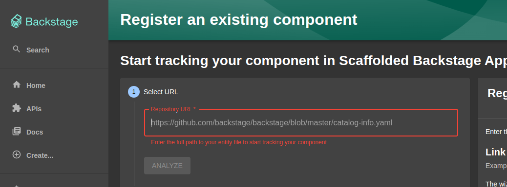

If all is good, you should have a registered backstage component, like
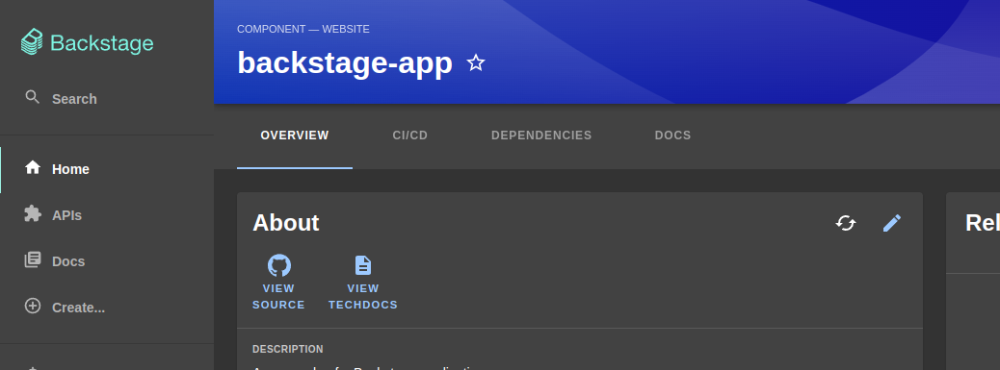

However, if you click on the "VIEW TECHDOCS" link, you'll get an error.
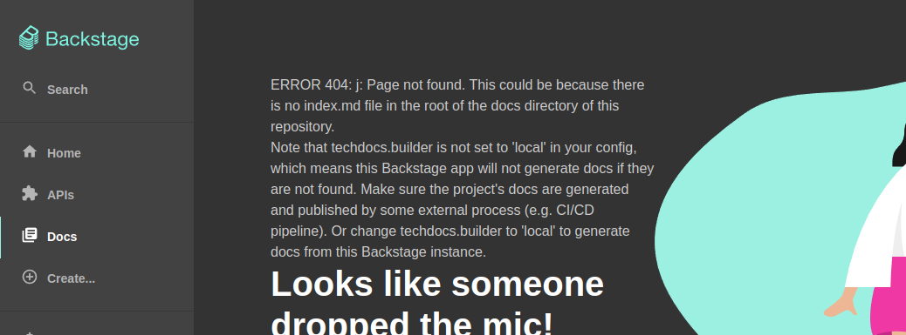

Adding our component doesn't automatically publish its TechDocs, since we've chosen an external builder (in ~app-config.production.yaml~), so that's on us.

Next, we'll setup a Github Action to publish to our compose cluster.

*** TechDocs Publish CI

The external builder setting in ~app-config.production.yaml~ is the Backstage recommended practice. But that means each repo with TechDocs needs a publish CI setup. We'll create a ~techdocs.yaml~ workflow, fashioned after [[https://backstage.io/docs/features/techdocs/configuring-ci-cd#example-github-actions-ci-and-aws-s3][Example: GitHub Actions CI and AWS S3]]. We'll replace AWS S3 storage with an ~scp~ and swap out the PlantUML support, in favor of [[https://mermaid.js.org/#/][MermaidJS]]. (Mermaid is a diagramming tool that is also [[https://github.blog/2022-02-14-include-diagrams-markdown-files-mermaid/][supported in Github Markdown rendering]].) Note that Backstage's [[https://backstage.io/docs/features/techdocs/how-to-guides#how-to-add-mermaid-support-in-techdocs][How to add Mermaid support in TechDocs]] procedure uses a separate [[https://kroki.io/][Kroki]] server, which we don't follow here, favoring a simpler "full static" approach.

Create ~.github/workflows/techdocs.yaml~, and copy in the contents of this [[https://github.com/rmorison/backstage-app/blob/main/.github/workflows/techdocs.yaml][techdocs.yaml]].

The one workflow step to note---and the most common source of errors---is the "Publish docs site via scp" step. The Docker cluster has a SSH service running on port 2222, which needs to be open on the firewall to your server. That SSH service can write to the Docker volume where Backstage looks for TechDocs, if you recall the ~techdocs~ section of our config. (That OpenSSH server is configured [[https://github.com/rmorison/backstage-docker/blob/main/docker-compose.yml#L62][here]] in the compose file, in case you're looking.)
#+begin_src yaml
      - name: Publish docs site via scp
        uses: appleboy/scp-action@master
        with:
          host: ${{ secrets.TECHDOCS_HOST }}
          key: ${{ secrets.TECHDOCS_SSH_PRIVATE_KEY }}
          username: techdocs
          port: 2222
          source: site
          target: /techdocs/${{ env.ENTITY_NAMESPACE }}/${{ env.ENTITY_KIND }}/${{ env.ENTITY_NAME }}
          strip_components: 1
          rm: true
#+end_src
Note the two secrets. These go in your Github repo action secrets. ~TECHDOCS_HOST~ is the domain name pointing at your server.

If you followed the [[https://github.com/rmorison/backstage-docker#techdocs-publish-ssh-keypair][TechDocs Publish SSH Keypair]] section you already have the private key. (If not, do that now, and update your ~.env~ with the *public* key, restart your cluster.) The ~TECHDOCS_SSH_PRIVATE_KEY~ in your repo actions secrets gets the contents of the private key file, ~techdocs_rsa~. 

And finally, note ~target:~. This value has to be just right for Backstage to find TechDocs. In particular, ~ENTITY_KIND~ must be lower case, which you'll see a previous action step for.

With that, commit, push, watch the action run, and try "VIEW TECHDOCS" again.
#+begin_src shell
  git add .github/workflows/techdocs.yaml
  git commit -m 'Workflow: Publish docs site via scp'
  git push
#+end_src

If all goes well...
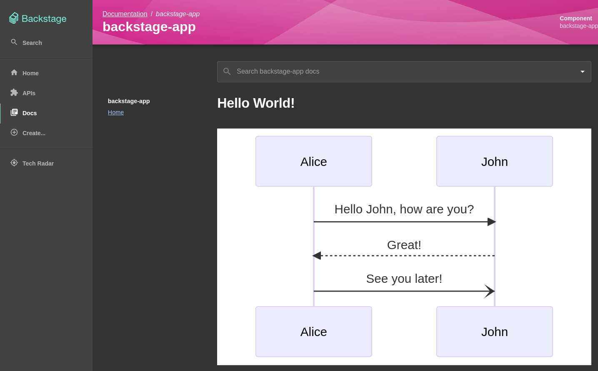

If not, it's time to debug.
** Are we done yet?
Backstage absolutely has a cost of ownership. The goal of this article is to make quick self hosting palatable for small projects and teams. If a Backstage adoption is successful and the team or scope grows, maintaining and evolving Backstage is a full time job. Again, there are excellent hosted versions, like [[https://roadie.io/][Roadie]], if you have a budget.

Is the value proposition worth it? That's a topic for another day.
** Pulling a New Backstage Build
Standard Docker stuff, but for reference
#+begin_src shell
  docker compose stop backstage \
      && docker compose rm -f backstage \
      && docker compose pull backstage \
      && docker compose up -d backstage
  docker compose logs -f backstage
#+end_src
** Questions or Issues?
Post in [[https://github.com/rmorison/backstage-app/discussions][backstage-app discussions]] or [[https://github.com/rmorison/backstage-docker/discussions][backstage-docker discussions]].
* DONE Tame the Viper: Golang CLI Settings with Cobra & Viper
CLOSED: [2023-04-16 Sun 21:55] SCHEDULED: <2023-04-13 Thu>
:PROPERTIES:
:EXPORT_FILE_NAME: tame-the-viper
:EXPORT_HUGO_CUSTOM_FRONT_MATTER: :topics '("Golang" "Viper" "Cobra")
:EXPORT_HUGO_CUSTOM_FRONT_MATTER+: :description "A working introduction to Cobra and Viper, a CLI configuration module for Golang apps"
:END:
** What are Cobra & Viper?
Golang comes with a [[https://pkg.go.dev/flag][flag package]] out of the box to parse garden variety command line flags. Many applications will want to use environment variables, particularly if they follow [[https://12factor.net/][Twelve-Factor App]] guidelines. The builtin [[https://pkg.go.dev/os][os package]] provides basic support. [[https://pkg.go.dev/github.com/joho/godotenv][GoDotEnv]] is a popular package with more functionality built in.

Otoh, [[https://github.com/spf13/cobra][Cobra]] & [[https://github.com/spf13/viper/][Viper]] take configuration to the next level, combining CLI flags, environment, and a config file with support for most popular formats:
- JSON, TOML, YAML, HCL, envfile and Java properties config files
  (from [[https://github.com/spf13/viper/#what-is-viper][What is Viper?]])
Viper's 45k "Imported by" stat shows the package's wide popularity among Go devs. And Cobra comes with a handy [[https://github.com/spf13/cobra-cli][Cobra Generator]] tool of it's own, to scaffold the code for new argument based CLI commands.

** The Problem with Viper...


The first and biggest blocker to using Viper is documentation. [[https://github.com/spf13/viper/blob/master/README.md][Viper's Github README]] has breadcrumbs, but Viper needs a user manual. This document aspires to that.

** What's on the Menu
We'll tackle Cobra + Viper features in three steps
1. Command line flags
2. Add environment vars
3. Marshal the config into a Go struct

** Getting Started
*** GitHub Repo for This Guide
The code used in this guide is available in the [[https://github.com/rmorison/tame-the-viper][tame-the-viper repo]].

*** Assumptions
You'll need a working Go development environment. Go's [[https://go.dev/doc/install][Download and install]] instructions are great. Personally, I use the [[https://github.com/stefanmaric/g][stefanmaric/g]] version manager to manage my Go compilers.

This walk-through was developed with ~1.19.1~
#+begin_src shell
  ~/Projects/github.com/rmorison/tame-the-viper   main $ g list

  1.17 
  1.17.3 
  1.17.4 
  1.17.5 
  > 1.19.1 
#+end_src

*** Cobra-CLI
We'll use the handy [[https://github.com/spf13/cobra-cli][cobra-cli]] to generate code for new commands. This tool saves time and provides consistent starting structure.
#+begin_src shell
  go install github.com/spf13/cobra-cli@latest
#+end_src

*** Go Mod Init
If you're coding along at home, you'll want to replace the Github account name here and throughout the Go imports.

We start a project with
#+begin_src shell
  mkdir tame-the-viper
  cd tame-the-viper
  go mod init github.com/rmorison/tame-the-viper
#+end_src

** Command Line Flags
*** First Steps
We're going to lay down first code with ~cobra-cli init~. Let's take a look at that tool's options with
#+begin_src shell
  cobra-cli --help
#+end_src
which gives
#+begin_src shell
  Cobra is a CLI library for Go that empowers applications.
  This application is a tool to generate the needed files
  to quickly create a Cobra application.

  Usage:
  cobra-cli [command]

  Available Commands:
  add         Add a command to a Cobra Application
  completion  Generate the autocompletion script for the specified shell
  help        Help about any command
  init        Initialize a Cobra Application

  Flags:
  -a, --author string    author name for copyright attribution (default "YOUR NAME")
  --config string    config file (default is $HOME/.cobra.yaml)
  -h, --help             help for cobra-cli
  -l, --license string   name of license for the project
  --viper            use Viper for configuration

  Use "cobra-cli [command] --help" for more information about a command.
#+end_src

We can use command line flags to set an author and license to drop into our new project , but instead lets take advantage ~cobra-cli~'s config file support. Create a ~.cobra.yaml~ file with
#+begin_src yaml
  author: Snake Charmer
  license: MIT
  useViper: true
#+end_src
Note the ~useViper~ setting. You can use Cobra without Viper, but Viper is where the real power lies. I always use them together.

Initialize your CLI project with
#+begin_src shell
  cobra-cli --config .cobra.yaml init
#+end_src
You should see
#+begin_src shell
  Using config file: .cobra.yaml
  Your Cobra application is ready at
  /home/rod/Projects/github.com/rmorison/tame-the-viper
#+end_src
and with ~ls *~
#+begin_src shell
  LICENSE  go.mod  go.sum  main.go

  cmd/:
  root.go
#+end_src

You can run
#+begin_src shell
  go mod tidy
  go run main.go
#+end_src
and see help text that you'll want to replace in the generated files:
#+begin_src text
  A longer description that spans multiple lines and likely contains
  examples and usage of using your application. For example:

  Cobra is a CLI library for Go that empowers applications.
  This application is a tool to generate the needed files
  to quickly create a Cobra application.
#+end_src

No big deal, but it gets better.

*** Add a Command
Lets add our first command, ~walk-dogs~. The ~cobra-cli~ builds a nice stub with
#+begin_src shell
  cobra-cli --config .cobra.yaml add walkDogs
#+end_src
and you'll see a new file, ~cmd/walkDogs.go~. The ~go run main.go --help~ now shows that command
#+begin_src text
  Available Commands:
  completion  Generate the autocompletion script for the specified shell
  help        Help about any command
  walkDogs    A brief description of your command
#+end_src

Let's look at the code generated for that new command. The top of ~cmd/walkDogs.go~ starts with
#+begin_src go
  /*
     Copyright © 2023 Snake Charmer

     Permission is hereby granted, free of charge, to any person obtaining a copy
#+end_src
That text is gratis the ~.cobra.yaml~ config file we're using. Front matter like this can be further customized per [[https://github.com/spf13/cobra-cli#configuring-the-cobra-generator][Configuring the cobra generator]]. 

Further down is the spec for our command:
#+begin_src go
  var walkDogsCmd = &cobra.Command{
          Use:   "walkDogs",
          Short: "A brief description of your command",
          Long: `A longer description that spans multiple lines and likely contains examples
  and usage of using your command. For example:

  Cobra is a CLI library for Go that empowers applications.
  This application is a tool to generate the needed files
  to quickly create a Cobra application.`,
          Run: func(cmd *cobra.Command, args []string) {
                  fmt.Println("walkDogs called")
          },
  }
#+end_src

One thing I typically change is the ~Use:~ value of the cobra command. The Cobra generator uses [[https://en.wikipedia.org/wiki/Camel_case][camel case]] for its command argument to support shells that have a problem with ~-~ in command strings. I don't write apps for those shells and the Unix shells I do implement for are fine with a command like ~walk-dogs~, which I prefer for readability and aesthetics.

Easy to change:
#+begin_src go
          Use:   "walk-dogs",
#+end_src
and the commands are now
#+begin_src shell
  Available Commands:
    completion  Generate the autocompletion script for the specified shell
    help        Help about any command
    walk-dogs   A brief description of your command
#+end_src

*** Add a Command Specific Flag
Viper supports "global" flags, called persistent flags, that will apply to all commands (subcommands, to be precise), and command specific flags, that can only be used with that specific command. Let's add a ~name~ flag. Go to the ~init()~ function and replace the instructive comments so the code looks like
#+begin_src go
  func init() {
          rootCmd.AddCommand(walkDogsCmd)

          // Here you will define your flags and configuration settings.

          walkDogsCmd.Flags().String("name", "Bella", "Which dog gets this walk")
          viper.BindPFlag("name", walkDogsCmd.Flags().Lookup("name"))
  }
#+end_src

The ~walkDogsCmd.Flags()~ line defines a command line flag, default value, and help text. ~viper.BindPFlag~ connects that flag to Viper's configuration map. Much more on that later.

If we ~go run main.go walk-dogs --help~ we see
#+begin_src shell
  Flags:
    -h, --help          help for walk-dogs
        --name string   Which dog gets this walk (default "Bella")
#+end_src

Back in ~walkDogs.go~ add a line to the ~Run:~ function,
#+begin_src go
          Run: func(cmd *cobra.Command, args []string) {
                  fmt.Println("walkDogs called")
                  fmt.Println("walking", viper.GetString("name"))
          },
#+end_src
Here, we're retrieving that config value from Viper. Try ~go run main.go walk-dogs~
#+begin_src shell
  walkDogs called
  walking Bella
#+end_src
then ~go run main.go walk-dogs --name Max~
#+begin_src shell
  walkDogs called
  walking Max
#+end_src

With the simple case covered, we can move on to what Cobra & Viper really bring to the table.

** Environment Variables
Environment variables are a widely popular choice, both for local developer and infrastructure configurations. The [[https://12factor.net/][Twelve Factor App]] helped popularized this use case.

Because we chose to include Viper in our ~cobra-cli~ init, the generator dropped the following function into ~cmd/root.go~
#+begin_src go
  // initConfig reads in config file and ENV variables if set.
  func initConfig() {
          // cfgFile code snipped...
          viper.AutomaticEnv() // read in environment variables that match
#+end_src
We'll get the omitted config file code [[*Structured Configs: Using a Config File][later]]. It's the ~AutomaticEnv()~ we're interested in now. That binds Viper keys to environment variables, uppercased, of course. Therefore, in a ~bash~ shell we can type
#+begin_src shell
  NAME=Luna go run main.go walk-dogs
#+end_src
and get
#+begin_src shell
  walkDogs called
  walking Luna
#+end_src

Viper has more detailed control of environment variable binding, see [[https://github.com/spf13/viper#working-with-environment-variables][Working with Environment Variables]]. But ~AutomaticEnv()~ gets it done and, with a small customization handles more complex configurations, as well see next.

** Configs for Multiple Commands
Let's add a new ~feed-cats~ command.
#+begin_src shell
  cobra-cli --config .cobra.yaml add feedCats
#+end_src
and in ~cmd/feedCats.go~ change the ~Use:~ line
#+begin_src go
          Use:   "feed-cats",
#+end_src

In this case we want to feed lots of cats. Rewrite the ~init()~ function in ~cmd/feedCats.go~ to
#+begin_src go
  func init() {
          rootCmd.AddCommand(feedCatsCmd)

          // Here you will define your flags and configuration settings.

          feedCatsCmd.Flags().StringArray("names", []string{}, "Which cats to feed")
          viper.BindPFlag("cats.names", feedCatsCmd.Flags().Lookup("names"))
  }
#+end_src
The ~StringArray~ flag supports a slice of strings and to feed all those cats. Note the ~"cats.names"~ key for this flag. That introduces structure that we'll utilize below.

Update the ~Run: func~ to
#+begin_src go
          Run: func(cmd *cobra.Command, args []string) {
                  fmt.Println("feedCats called")
                  fmt.Println("feeding", viper.GetStringSlice("cats.names"))
          },
#+end_src
and lets feed some cats.
#+begin_src shell
  go run main.go feed-cats --names Loki --names Callie
#+end_src
outputs
#+begin_src shell
feedCats called
feeding [Loki Callie]
#+end_src

*** Structure in Environment Variables
If you try
#+begin_src shell
  NAMES=Binx go run main.go feed-cats
#+end_src
Binx doesn't get fed
#+begin_src shell
  feedCats called
  feeding []
#+end_src

We could try ~CATS.NAMES=Binx~, but that's not a valid environment variable name:
#+begin_src shell
  CATS.NAMES=Binx: command not found
#+end_src

Viper provides a rewrite rule to map structured keys to valid environment variables. Go back to ~initConfig()~ in ~cmd/root.go~ and above ~viper.AutomaticEnv()~ edit as follows
#+begin_src go
          replacer := strings.NewReplacer(".", "_")
          viper.SetEnvKeyReplacer(replacer)
          viper.AutomaticEnv() // read in environment variables that match
#+end_src
The ~NewReplacer~ + ~SetEnvKeyReplacer()~  does what you expect, replaces the ~.~ with ~_~. So now
#+begin_src shell
  CATS_NAMES=Binx,Mage go run main.go feed-cats
#+end_src
gives
#+begin_src shell
  feedCats called
  feeding [Binx,Mage]
#+end_src
Great. Or not. Let's investigate with an indispensable tool for working with Viper.

Create a new ~cmd/configTools.go~ file with
#+begin_src go
  package cmd

  import (
          "log"

          "github.com/spf13/viper"
          "gopkg.in/yaml.v2"
  )

  func yamlStringSettings() string {
          c := viper.AllSettings()
          bs, err := yaml.Marshal(c)
          if err != nil {
                  log.Fatalf("unable to marshal config to YAML: %v", err)
          }
          return string(bs)
  }

#+end_src
(Full D: comes straight off the [[https://github.com/spf13/viper#marshalling-to-string][Marshalling to string]] [sic] section in the Viper docs.)

Now, add another line to the ~Run: func~, so we have
#+begin_src go
          Run: func(cmd *cobra.Command, args []string) {
                  fmt.Println("feedCats called")
                  fmt.Println("feeding", viper.GetStringSlice("cats.names"))
                  fmt.Printf(yamlStringSettings())
          },
#+end_src

Now
#+begin_src shell
  CATS_NAMES=Binx,Mage go run main.go feed-cats
#+end_src
outputs
#+begin_src shell
  feedCats called
  feeding [Binx,Mage]
  cats:
    names: Binx,Mage
  name: Bella
#+end_src

Compare that to the output of
#+begin_src shell
  go run main.go feed-cats --names Binx --names Mage
#+end_src
namely
#+begin_src shell
  feedCats called
  feeding [Binx Mage]
  cats:
    names:
    - Binx
    - Mage
  name: Bella
#+end_src
See the problem? Our env var input is for one cat named ~"Binx,Mage"~, not two cats. (And that's a awful name for a cat, too.) Viper doesn't assume any format beyond "plain string" for environment values. Nor should it, there's no standard and no reason for Viper to have an opinion.

But lets say we want to support simple, comma delimited text. We'll have to do that ourselves. Update ~Run: func~ to
#+begin_src go
          Run: func(cmd *cobra.Command, args []string) {
                  fmt.Println("feedCats called")
                  viper.Set("cats.names", strings.Split(viper.GetString("cats.names"), ","))
                  fmt.Println("feeding", viper.GetStringSlice("cats.names"))
                  fmt.Printf(yamlStringSettings())
          },
#+end_src
and on
#+begin_src shell
  CATS_NAMES=Binx,Mage go run main.go feed-cats
#+end_src
you should see those cats feed correctly
#+begin_src shell
  feedCats called
  feeding [Binx Mage]
  cats:
    names:
    - Binx
    - Mage
  name: Bella
#+end_src

Since the parsing of env var values is on us, we can adopt whatever formatting convention we choose. JSON? Sure
#+begin_src go
          Run: func(cmd *cobra.Command, args []string) {
                  fmt.Println("feedCats called")
                  jsonValues := viper.GetString("cats.names")
                  var values []string
                  if err := json.Unmarshal([]byte(jsonValues), &values); err != nil {
                          fmt.Println(err, "->", jsonValues)
                          os.Exit(1)
                  }
                  viper.Set("cats.names", values)
                  fmt.Println("feeding", viper.GetStringSlice("cats.names"))
                  fmt.Printf(yamlStringSettings())
          },
#+end_src
and
#+begin_src shell
  CATS_NAMES='["Binx","Mage"]' go run main.go feed-cats
#+end_src
works.

But Houston, we have a problem.
#+begin_src shell
  go run main.go feed-cats --names Binx --names Mage
#+end_src
gives
#+begin_src shell
  feedCats called
  unexpected end of JSON input -> 
  exit status 1
#+end_src

We hit this error because ~jsonValues~ var is an empty string. Why is that?

Well, when Viper matches a key via environment variable it only knows set the value to a string. Viper has no builtin rule to parse env values. But remember our flag definition
#+begin_src go
          feedCatsCmd.Flags().StringArray("names", []string{}, "Which cats to feed")
          viper.BindPFlag("cats.names", feedCatsCmd.Flags().Lookup("names"))
#+end_src
With flags Viper builds a structured ~cats~ key of type ~[]string~.

Viper ~Get*~ functions, when asked to lookup a key of the wrong type, will simply return the default value for the requested type. That is, ~viper.GetString("cats.names")~ returns ~""~ when ~cats.names~ is a ~[]string~ instead of a ~string~. Viper also doesn't provide a direct way to know whether a key is set by default value, flag, or environment. It's possible to write code that introspects that (try Google or ChatGPT), but for now we'll apply a simple fix.
#+begin_src go
          Run: func(cmd *cobra.Command, args []string) {
                  fmt.Println("feedCats called")
                  jsonValues := viper.GetString("cats.names")
                  var values []string
                  if err := json.Unmarshal([]byte(jsonValues), &values); err == nil {
                          viper.Set("cats.names", values)
                          fmt.Println("cat names from env")
                  }
                  fmt.Println("feeding", viper.GetStringSlice("cats.names"))
                  fmt.Printf(yamlStringSettings())
          },
#+end_src

*** The Problem with Environment and Flag Configs
Environment and flag configurations work great as long as the information stays flat, or close to it. As configurations get more complex specifying these configs becomes a problem. We're faced with writing "one line configs", i.e., collapse JSON, YAML, etc. into a single line and dropping that into an env or flag spec. Escaping characters and line breaks for these is no fun and brittle. Easy to read YAML becomes gobbledygook in a single line.

Tl;dr is environment variables are fine for key/value pairs, where values are simple types, but brittle for structured configurations.

** Structured Configs: Using a Config File
Let's look at Viper's support for finger and eye friendly config files. As mentioned [[*What are Cobra & Viper?][above]] plays nice with most common formats. We'll use YAML here.

Good news: the ~feed-cats~ command is ready to roll for a config file as is.

In the directory, where ~main.go~ lives, create ~.tame-the-viper.yaml~ with
#+begin_src yaml
  cats:
    names:
      - Simba
      - Kitty
#+end_src

Then, with a simple
#+begin_src shell
  go run main.go feed-cats --config .tame-the-viper.yaml
#+end_src
you should get
#+begin_src yaml
  Using config file: .tame-the-viper.yaml
  feedCats called
  feeding [Simba Kitty]
  cats:
    names:
    - Simba
    - Kitty
  name: Bella
#+end_src
Easy.

*** Value Precedence
Now that we're mixing environment, flag, and config file settings, it's worth reviewing their precedence. Viper uses the following precedence order. Each item takes precedence over the item below it:
- explicit call to Set
- flag
- env
- config
- key/value store
- default
  (from [[https://github.com/spf13/viper][Why Viper?]])

*** Customize initConfig
Let's look at the config file setup. The ~cobra-cli~ put it in the ~cmd/root.go~ file.
#+begin_src go
  // initConfig reads in config file and ENV variables if set.
  func initConfig() {
          if cfgFile != "" {
                  // Use config file from the flag.
                  viper.SetConfigFile(cfgFile)
          } else {
                  // Find home directory.
                  home, err := os.UserHomeDir()
                  cobra.CheckErr(err)

                  // Search config in home directory with name ".tame-the-viper" (without extension).
                  viper.AddConfigPath(home)
                  viper.SetConfigType("yaml")
                  viper.SetConfigName(".tame-the-viper")
          }
#+end_src
The ~cfgFile~ string is a package var that will get set by the ~--config~ flag, via
#+begin_src go
          rootCmd.PersistentFlags().StringVar(&cfgFile, "config", "", "config file (default is $HOME/.tame-the-viper.yaml)")
#+end_src
in the ~init()~ function.

Notice that if ~cfgFile~ is unset, the ~else~ branch above will look for ~$HOME/.tame-the-viper.yaml~ as the config. This behavior is from the code the ~cobra-cli~ put down, but we can change it. My preference is, rather than the homedir, default to a config file in the current working direction, typically the path where ~main.go~ is invoked from. (More of a "dotenv" behavior, fwiw.)

Change the ~else~ clause to
#+begin_src go
                  // Find cwd directory.
                  cwd, err := os.Getwd()
                  cobra.CheckErr(err)

                  // Search config in home directory with name ".tame-the-viper" (without extension).
                  viper.AddConfigPath(cwd)
                  viper.SetConfigType("yaml")
                  viper.SetConfigName(".tame-the-viper")
#+end_src
And if you want to change from YAML to TOML, JSON, dotenv, etc., this is the spot. If what you want is a traditional dotenv setup, ~"dotenv"~ in ~viper.SetConfigType~ will get that done.

Also, update the doc string in the flag spec. In the ~init()~ function, update the config flag to
#+begin_src go
          rootCmd.PersistentFlags().StringVar(&cfgFile, "config", "", "config file (default is $PWD/.tame-the-viper.yaml)")
#+end_src

Just like the "Don't commit .env files" practice, I always add the app's default config to ~.gitignore~ (assuming git)...
#+begin_src go
  .tame-the-viper.yaml
#+end_src

** Complex Configs
Above, we made the case that much beyond flat key/value settings, environment and flag configs are challenging. Let's tackle a more complex, structured config now that we have a config file to work with.

Use ~cobra-cli~ and add a new command:
#+begin_src shell
  cobra-cli --config .cobra.yaml add herdKittens
#+end_src
Change the ~Use:~ in ~cmd/herdKittens.go~ to
#+begin_src go
          Use:   "herd-kittens",
#+end_src

For this config we're going to dispense with environment and flag settings, and go straight to a config struct in Go and config file in YAML. We'll circle back on that dispensation later.

We're going to have Viper unmarshal a config from a YAML file into a Go struct. Under the import block of ~cmd/herdKittens.go~ add
#+begin_src go
  type KittenConfig struct {
          Mother string
          Father string
          Litter []struct {
                  KittenName string
                  FurPattern string
                  Gender     string
          }
  }

  var kittenConfig KittenConfig
#+end_src
and below that, at the ~Run: func~, change it to
#+begin_src go
          Run: func(cmd *cobra.Command, args []string) {
                  fmt.Println("herdKittens called")
                  if err := viper.UnmarshalKey("kittens", &kittenConfig); err != nil {
                          log.Fatalf("unable to marshal config to YAML: %v", err)
                  }
                  fmt.Printf("herding the clowder %+v\n", kittenConfig)
          },
#+end_src
Here ~viper.UnmarshalKey~ will find the top level "kittens" key in the config and write it's contents into ~kittenConfig~.

#+begin_src shell
  go run main.go herd-kittens
#+end_src
outputs
#+begin_src shell
  Using config file: /home/rod/Projects/github.com/rmorison/tame-the-viper/.tame-the-viper.yaml
  herdKittens called
  herding the clowder {Mother:Cleo Father:Jack Litter:[{KittenName: FurPattern: Gender:Male} {KittenName: FurPattern: Gender:Female} {KittenName: FurPattern: Gender:Female}]}
#+end_src

There's a problem: ~KittenName~ and ~FurPattern~ are default valued, empty strings. ~UnmarshalKey~ uses the [[https://pkg.go.dev/github.com/mitchellh/mapstructure][mapstructure]] package, so we need to help Viper with the YAML keys. Amend the ~KittenConfig~ type as follows.
#+begin_src go
  type KittenConfig struct {
          Mother string
          Father string
          Litter []struct {
                  KittenName string `mapstructure:"kitten_name"`
                  FurPattern string `mapstructure:"fur_pattern"`
                  Gender     string
          }
  }

#+end_src
and the output is now
#+begin_src shell
  Using config file: /home/rod/Projects/github.com/rmorison/tame-the-viper/.tame-the-viper.yaml
  herdKittens called
  herding the clowder {Mother:Cleo Father:Jack Litter:[{KittenName:Oscar FurPattern:Tabby Gender:Male} {KittenName:Daisy FurPattern:Bicolor Gender:Female} {KittenName:Lola FurPattern:Colorpoint Gender:Female}]}
#+end_src
...Spot on!

** Mixing Environment and Flags with Complex Configs
Yes, you can do it, as we've shown for ~feed-cats~.  There we used Viper's flag notation ~"cats.names"~ to connect to the YAML object structure. But that notation only goes so far. You might think that a flag key like ~"kittens.litter.1.kitten_name"~ would get us the first kitten's name in ~herd-kittens~, but no, Viper doesn't support that.

Another limitation affects mixing ~viper.Unmarshal~ and flags. See [[https://github.com/spf13/viper/issues/368][Binding flags as nested keys does not work #368]] in the Viper issues list. Down that thread [[https://github.com/spf13/viper/issues/368#issuecomment-1127455123][this snippet]] is offered as a workaround. I've used that patch with success.

However, consider if the use case is compelling enough to warrant the added complexity. In my case, it did for a particular project. There I added
#+begin_src go
  func UnmarshalConfigKey(key string, out interface{}) error {
          settings := viper.AllSettings()
          return mapstructure.Decode(settings[key], out)
  }
#+end_src
to the ~cmd~ package and call that instead of ~viper.Unmarshal~. 

Further travel down that rabbit hole is beyond the scope of this article.

** Wrapping up

*** Subcommands
One feature we haven't covered is subcommands. Let's say we wanted the following groups of commands:
- ~go run main.go feed cats~
- ~go run main.go feed dogs~
- ~go run main.go herd cats~
- ~go run main.go herd cattle~

We would run the following commands
#+begin_src shell
  cobra-cli add feed
  cobra-cli add herd
  cobra-cli add cats create -p 'feedCmd'
  cobra-cli add dogs create -p 'feedCmd'
  cobra-cli add cats create -p 'herdCmd'
  cobra-cli add cattle create -p 'herdCmd'
#+end_src
and proceed similarly to the above examples. The rest of this pattern is an exercise for the reader.

*** Final thoughts
Viper provides a reasonable solution CLI applications that just need traditional key/value "dotenv" support, on par with other packages. For complex configurations that push the limits of that simple model Viper brings much more to the table and can replace many lines of config crunching code.

It's fair to say Viper has wrinkles and subtleties that don't jump out of the package docs. Hopefully this article helps.

[[./img/portrait_of_woman_with_two_snakes_wrapped_around_her-scopio-b73eeac1-31fc-4229-9745-b2369af022fb.jpg]]

* DONE Proxy an iOS App to a Dev or Test Server
CLOSED: [2023-05-06 Sat 14:02]
:PROPERTIES:
:EXPORT_FILE_NAME: proxy-ios-app-to-dev-test-server
:EXPORT_HUGO_CUSTOM_FRONT_MATTER: :topics '("QA & Test" "Backend Dev" "Networking")
:EXPORT_HUGO_CUSTOM_FRONT_MATTER+: :description "How to get a mobile app with hard wired API urls to talk to a dev or test server with mitmproxy"
:END:


** DISCLAIMER
This procedure describes a configuration that carries some security risk. In fact, most local developer environments host a variety of security risks: locally stored passwords and keys, production data, proprietary source code and secrets, etc. If you're working on a proprietary project you should confirm with your IT or InfoSec department that running a local Man-in-the-Middle proxy is allowed. Read [[https://en.wikipedia.org/wiki/Man-in-the-middle_attack][Man-in-the-middle attack]] to understand why all this mitm stuff keeps [[https://en.wikipedia.org/wiki/Chief_information_security_officer][CISOs]] up at night.

Finally, while the setup can be very useful and is widely shared among developers, you should absolutely not run the proxy when not in use and remove any added CA certs when there is no longer a need.

More formally:

This Man-in-the-Middle (MITM) proxy setup is provided for educational, testing, and debugging purposes only. It is not intended for any unauthorized, malicious, or unethical activities. By using this tool, you agree to take full responsibility for your actions and any consequences that may arise from using this software. The developers and distributors of this setup disclaim any liability or responsibility for any misuse, harm, or damages resulting from the use of a MITM proxy tool. Use of this tool implies that you understand and accept these terms and will not use it in any manner that violates applicable laws, regulations, or ethical standards.

** The Scenario
First, did you read the [[*DISCLAIMER][DISCLAIMER]]? Read it!

You're writing a data API backend for a mobile app. You need to devtest or debug against your locally running backend, but the app doesn't have any developer hidden settings or Easter egg, e.g., to set the API domain. Production mobile apps should *absolutely not* have any test or debug "hidden menus".

The [[https://mitmproxy.org/][mitmproxy]] app can proxy the mobile app API calls to a local server, handling https with a fake cert and CA. Setup is straightforward, but a little hard to fish out of the docs. This document is a quick how-to and might save you some and trial/error time if you've never setup a man-in-the-middle proxy before.

Note: the [[https://www.charlesproxy.com/][Charles Proxy]] also supports this setup, but I find its freemium features annoying and its documentation a little scattered, at least for this use case. Furthermore, /mitmproxy/ is open source, carefully built with security in mind, and has a very powerful custom add-on capability. Otoh, I can recommend the [[https://apps.apple.com/us/app/charles-proxy/id1134218562][Charles Proxy iOS app]], which is quite handy for sniffing traffic on your mobile device.

** How mitmproxy Works
The [[https://docs.mitmproxy.org/stable/concepts-howmitmproxyworks/][How mitmproxy works]] page is worth reading, but the essential bit is 
#+begin_quote
Mitmproxy includes a full CA implementation that generates interception certificates on the fly. To get the client to trust these certificates, we register mitmproxy as a trusted CA with the device manually.
#+end_quote

** Proxy Setup
I'll refer to your local computer, where you can run an API service for a mobile app, as /dev host/ below, and your mobile device as /iOS device/.

*** Install mitmproxy on your dev host
Installation instructions at https://docs.mitmproxy.org/stable/overview-installation/

*** Get your dev host's local IP address
It helps to know your subnet mask here, typically starting with ~192.168~, ~172.16~ or ~10.~. Your local system connects to the network with this address. Note that this address can change with time, but not often if the router (DHCP server specifically) does not get reconfigured or replaced. (If you have access, most DHCP services allow your to lock in an address for your MAC, beyond scope here.)

**** OSX and Linux with net-tools installed
Open /System Preferences/->/Network/ and select your network, look for the /IPv4 Address/ entry. Or, in a terminal
#+begin_src shell
  ifconfig | grep "inet " | grep -v 127.0.0.1
#+end_src
should show you the address you're looking for.

****  Newer versions of Linux
#+begin_src shell
  ip -4 addr | grep "inet " | grep -v 127.0.0.1
#+end_src

*** Install mitmproxy CA certs
**** Run mitmproxy
First we need to install and trust mitmproxy's fake root certificates on our iOS device and on our dev host. Mitm provides a URL that, when accessed through ~mitmproxy~, lets you download those certs. This approach is recommended, but there are [[https://docs.mitmproxy.org/stable/concepts-certificates/#installing-the-mitmproxy-ca-certificate-manually][manual installation instructions]] available if you need them.

On your dev host open a terminal and run
#+begin_src shell
  mitmproxy --listen-host 0.0.0.0 --listen-port 8080
#+end_src

***** Firewall checkpoint
If you're running a local firewall you may get an alert asking if traffic to port 8080 should be allowed. "Yes". 

If you're running ~ufw~ on Linux, that "alert" is probably in ~/var/log/auth.log~ and you'll need to run
#+begin_src shell
  sudo ufw allow from 192.168.1.0/24 to any port 8080
#+end_src
substituting you're local network mask for ~192.168.1.0/24~.

**** Point your local system at the mitmproxy
Rather than repeat something well documented on the net, a search for [[https://duckduckgo.com/?q=browser+set+manual+proxy+server&ia=web][browser set manual proxy server]] should turn up adequate instructions. You should end up at a screen similar to
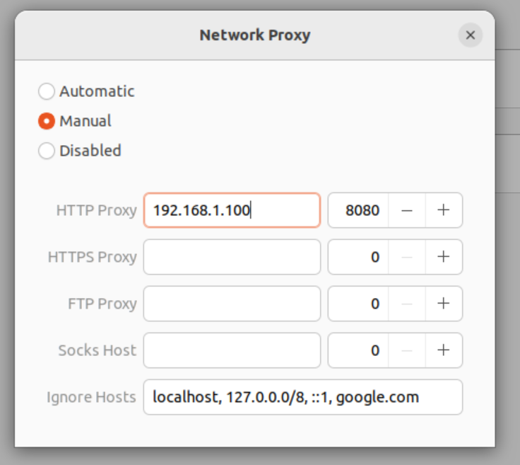

Select /Manual/, enter your dev host's IP address from above as the HTTP Proxy, enter 8080 as the port. Don't select any form or authentication (if offered). If there's an /Ignore Hosts/ setting, that is completely optional. We'll only use this proxy setup one time on the dev host, to get certs, and then disable it.

**** Install CA cert on dev host
Back at a browser enter the site ~http://mitm.it/~, making sure to use ~http~ here, not ~https~. You should get this page.
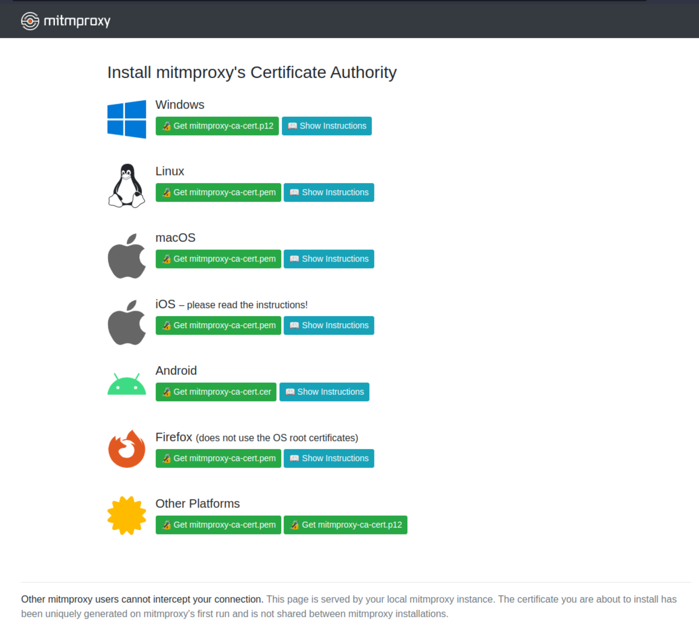

Click /Show Instructions/ and then the green /Get mitmproxy-ca-cert.pem/ button for you platform. Follow those instructions.

***** Security Note
The fine print at the bottom
#+begin_quote
Other mitmproxy users cannot intercept your connection. This page is served by your local mitmproxy instance. The certificate you are about to install has been uniquely generated on mitmproxy's first run and is not shared between mitmproxy installations.
#+end_quote
is an essential feature that keeps your CA cert unique and prevents potentially malicious hacking by others. Do not let this cert be compromised!

**** Disable the proxy on dev host
Your dev host is setup, disable the proxy from the same place you set it up.

**** Install CA cert on iOS device
The iOS device CA cert setup is analogous. I'll refer you to [[https://duckduckgo.com/?q=ios+set+manual+proxy+server&ia=web][iOS set manual proxy server]] for instructions. Make sure you use the same network that your dev host is on. You should get to this screen and enter the same /Server/ and /Port/ as your dev host.
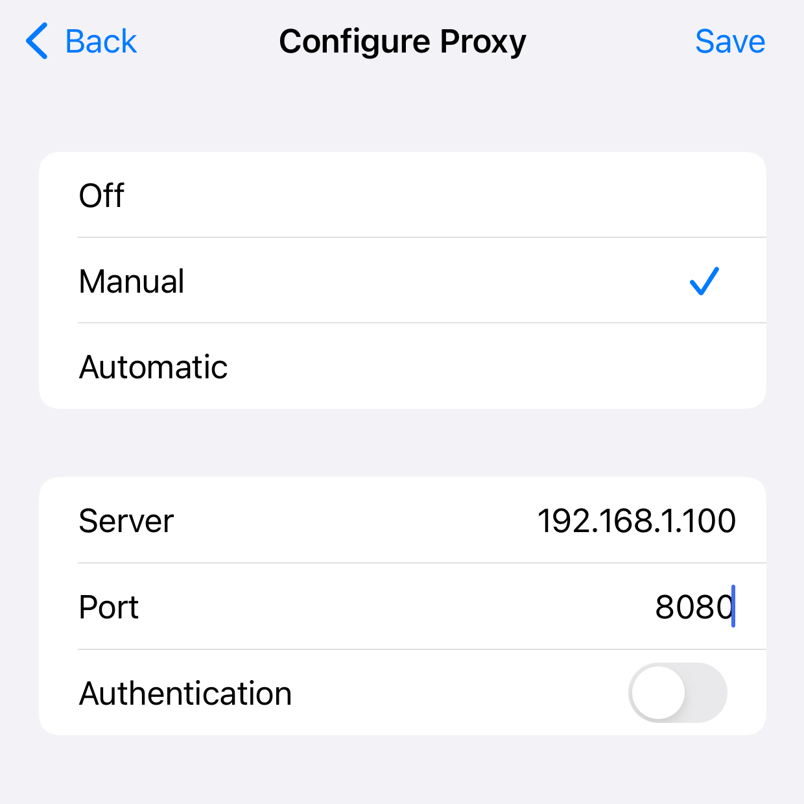

Open Safari and again browse to ~http://mitm.it/~, download the cert and follow the instructions, making sure you include the **Important:** step.
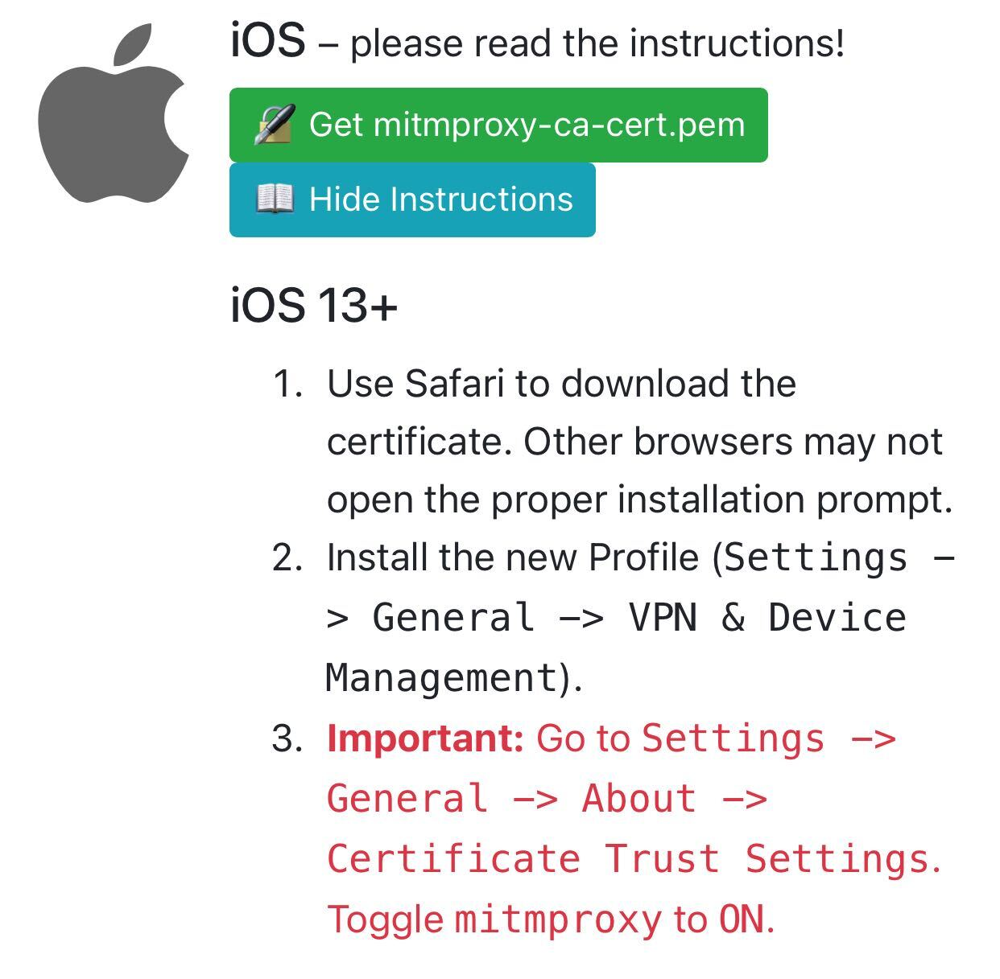


** Let's Go!
Now we're ready to roll!

*** Checklist
- [ ] Your local API service is up and running. I'll assume it's on port ~3000~, adjust as needed.
- [ ] Your iOS device is setup with manual proxy to your dev host on port ~8080~. (The dev host does not need to point at the proxy.)
- [ ] The iOS app you want to test with is installed on your device.

*** Map Traffic to Your Dev Host

Stop any running ~mitmproxy~ with a ~q~ command and start it back up with with the ~--map-remote~ option, replacing ~example.com~ with the domain name of the API your want to map to your dev host. 
#+begin_src shell
  mitmproxy --map-remote '|https://example.com|http://localhost:3000'
#+end_src
If there are multiple APIs, use multiple ~--map-remote~ options. Or, you can edit the ~map_remote~ setting while the proxy is running with the ~O~ command, click or arrow down to ~map_remote~, hit ~ENTER~ to edit, ~ESC~ to finish, and ~q~ to return to the options list. (One more ~q~ to return to the /Flows/ screen.)
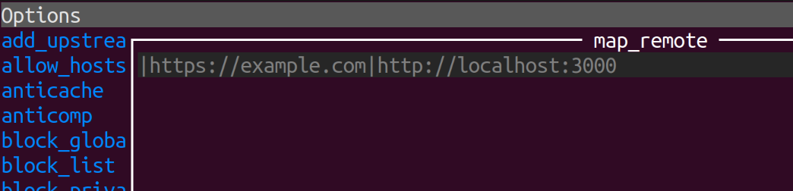

*** Try It Out
Start your app on your iOS device. Requests to the mapped domains should be routing to your local dev host. Verify with request logging.

** Back it Out
As mentioned, when not actively needed it is recommended to disable the proxy setup. On your dev host, just don't run ~mitmproxy~. For a permanent disable, remove your locally installed CA cert from the system. What you did in [[*Install mitmproxy on your dev host][Install mitmproxy on your dev host]], undo that.

On your iOS device un-trust the CA from /Settings/ -> /General/ -> /About/ -> /Certificate Trust Settings/. That's good enough for temporary disablement. Delete the profile for a permanent backout (/Settings/ -> /General/ -> /VPN & Device Management/.)

** Postscript

The [[https://mitmproxy.org/][mitmproxy]] program can do many other useful things for development and testing. See the [[https://docs.mitmproxy.org/stable/overview-features/][features]] section for a list of baked in capabilities. And if you need even more customization, there's an [[https://docs.mitmproxy.org/stable/addons-overview/][addon]] capability; you can write your own Python code for custom effects. The [[https://github.com/mitmproxy/mitmproxy/tree/main/examples][examples]] dir in the mitmproxy repo is full of interesting stuff. Tools for the toolbox.


* DONE Jupyter Setup with Mamba and Conda
CLOSED: [2023-05-10 Wed 16:54]
:PROPERTIES:
:EXPORT_FILE_NAME: jupyter-setup-with-mamba-conda
:EXPORT_HUGO_CUSTOM_FRONT_MATTER: :topics '("Data Engineering" "Python" "Machine Learning")
:EXPORT_HUGO_CUSTOM_FRONT_MATTER+: :description "A detailed, from scratch guide to Jupyter installation with Mamba and Conda for data engineering, machine learning, ..."
:END:

[[./img/2_men_in_black_and_gray_jacket_standing_on_rock_formation_during_night_time-scopio-d494b247-0a74-4382-986d-24f0d5d6e930.jpg]]

Jupyter notebooks are widely used and a great tool for interactive Python work. Notebooks are especially useful for analytics, machine learning, and scientific computing demonstrations.

** Python Packaging (in about 100 words)
There are many (many) ways to install and run Jupyter notebooks. The one given here includes some recent best practices incorporated into the [[https://mamba.readthedocs.io/en/latest/index.html][Mamba]] package manager. It's worth noting the alternatives.
1. [[https://docs.conda.io/projects/conda/en/latest/index.html][Conda]] - You'll get and use Conda with a Mamba install. In fact, it's the inspiration for Mamba: fast Conda. But you can work with Conda straight away, without Mamba, if you like.
2. [[https://pip.pypa.io/en/stable/][Pip]] - The canonical Python installer. Available [[https://www.anaconda.com/blog/using-pip-in-a-conda-environment][when the need arises]], within your Mamba / Conda install.
3. [[https://python-poetry.org/][Poetry]] - A leading choice for building Python libraries and service applications. However, since binary library dependencies are fulfilled by the operating system installation, can be a pita.
4. [[https://pipenv.pypa.io/en/latest/][Pipenv]], [[https://flit.pypa.io/en/stable/][Flit]], [[https://hatch.pypa.io/latest/][Hatch]], ... - In the Poetry camp.

** Mamba Install
The [[https://mamba.readthedocs.io/en/latest/installation.html][Mamba Installation]] page sends you right over to the [[https://github.com/conda-forge/miniforge#mambaforge][miniforge repo]] for details. There are self-extracting shell archives there, you can download and install with. Or you can ~curl~ or ~wget~ the same file. I'll use ~curl~.

#+begin_src shell
  curl -L -O "https://github.com/conda-forge/miniforge/releases/latest/download/Mambaforge-$(uname)-$(uname -m).sh"
  bash Mambaforge-$(uname)-$(uname -m).sh
#+end_src

**** What Got Installed and How Mamba Runs
/This section is optional and covers how mamba is invoked, skip if you just want to install stuff./

It's worth taking a look at what the installer setup, insofar as how Mamba runs. Check the tail of your shell rc file. The exact file varies by shell and platform, but on Ubuntu for Bash,
#+begin_src shell
  tail -25 ~/.bashrc
#+end_src
gives
#+begin_src shell
  # >>> conda initialize >>>
  # !! Contents within this block are managed by 'conda init' !!
  __conda_setup="$('/home/me/mambaforge/bin/conda' 'shell.bash' 'hook' 2> /dev/null)"
  if [ $? -eq 0 ]; then
      eval "$__conda_setup"
  else
      if [ -f "/home/me/mambaforge/etc/profile.d/conda.sh" ]; then
          . "/home/me/mambaforge/etc/profile.d/conda.sh"
      else
          export PATH="/home/me/mambaforge/bin:$PATH"
      fi
  fi
  unset __conda_setup

  if [ -f "/home/me/mambaforge/etc/profile.d/mamba.sh" ]; then
      . "/home/me/mambaforge/etc/profile.d/mamba.sh"
  fi
  # <<< conda initialize <<<
#+end_src

If you look at the ~mamba.sh~ and ~conda.sh~ you'll notice that ~mamba~ and ~conda~ are implemented as shell functions that call programs in ~mambaforge/bin~.

This snippet from  ~mamba.sh~ is how Mamba wires up to your shell/terminal.
#+begin_src shell
  mamba() {
      \local cmd="${1-__missing__}"
      case "$cmd" in
          activate|deactivate)
              __conda_activate "$@"
              ;;
          install|update|upgrade|remove|uninstall)
              __mamba_exe "$@" || \return
              __conda_reactivate
              ;;
          ,*)
              __mamba_exe "$@"
              ;;
      esac
  }
#+end_src
The takeaway here is Mamba falls back to Conda for ~activate~ and ~deactivate~, commands we'll cover below.

Lets look at the programs that actually get invoked, after this indirection.
#+begin_src shell
  (cd ~/mambaforge/bin/ && file conda* mamba* python*)
#+end_src
outputs (slightly edited)
#+begin_src shell
  conda:             a $HOME/mambaforge/bin/python script, ASCII text executable
  conda2solv:        ELF 64-bit LSB pie executable, x86-64, version 1 (SYSV), ...
  conda-env:         a $HOME/mambaforge/bin/python script, ASCII text executable
  mamba:             a $HOME/mambaforge/bin/python script, ASCII text executable
  mamba-package:     ELF 64-bit LSB pie executable, x86-64, version 1 (GNU/Linux), ...
  python:            symbolic link to python3.10
  python3:           symbolic link to python3.10
  python3.1:         symbolic link to python3.10
  python3.10:        ELF 64-bit LSB pie executable, x86-64, version 1 (SYSV), ...
  python3.10-config: POSIX shell script, ASCII text executable, with very long lines (465)
  python3-config:    symbolic link to python3.10-config
#+end_src

Tl;dr: The installation comes with a recent version of Python, which is (or aliased to) a compiled binary program, ~python3.10~ here. Mamba and Conda themselves are Python scripts. However, Mamba's performance comes from invoking compiled binary code via libraries and it's use of an [[https://mamba.readthedocs.io/en/latest/advanced_usage/package_resolution.html][SAT package resolution algorithm]]. The [[https://github.com/mamba-org/mamba][Mamba repo]] has the implementation itself, if you're interested.

** Conda Environments
Post install, if you start a new shell or source the shell rc file cited above, e.g., ~source ~/.bashrc~ Mamba will prepend your shell prompt with an environment name in parens. If you have a fresh install that will look like
#+begin_src shell
  (base) rod@host:~$
#+end_src

It's ~(base)~ that we're looking for, the rest depends on your current shell prompt settings.

*** What's a Conda Environment?
Python, similar to many other languages, has evolved over the decades of its use. The needs of Python developers and the products they create drove an evolution in how the language was installed and run. In days of yore programmers developed a variety of ad-hoc ways to keep the Python setup for different projects from colliding. Let's say project A only worked with Python V2 and project B required Python V3. Then project C used V3, but needed a different version of, say, the Django package.

The [[https://docs.python.org/3/library/venv.html][venv]] package is now a standard part of Python to solve this problem. Long story short, it only goes part way. Many "Pure Python" libraries are in wide use, that will work on any OS. But some libraries require "binary support", meaning compiled OS specific code. The ~venv~ package doesn't fully solve this problem.

Because very often the binary component of a Python library is used for performance and access to hardware acceleration, this problem is very common problem in big data, machine learning, and scientific computing spaces. The developers in these fields saw the need for a holistic Python virtual environment solution.

That then is the key differentiator between an "old school" Python virtualenv and a Conda environment: comprehensive isolation of Python, installed libraries, /and/ their binary components.

Should you use Conda environments for everything in Python? No. The [[*Python Packaging (in about 100 words)][other solutions]] have strong use cases. But for data engineering, probably. Personally, if it's a project I'll want a Jupyter notebook for, it's Mamba ftw.

*** Best Practice: Don't install in the base env
From the [[https://mamba.readthedocs.io/en/latest/user_guide/concepts.html#base-environment][Base Environment]] section:
#+begin_quote
This is a legacy environment from ~conda~ implementation that is still heavily used.
The base environment contains the ~conda~ and ~mamba~ installation alongside a Python installation (since ~mamba~ and ~conda~ require Python to run).

~mamba~ and ~conda~, being themselves Python packages, are installed in the base environment, making the CLIs available in all activated environments based on this base environment.
#+end_quote

You'll find debate on Conda environment best practices [[https://duckduckgo.com/?q=conda+environment+best+practices&t=brave&ia=web][all over the net]]. Lets just take "leave base clean" as a given and create a new env.

** Create a "default" Conda Environment
My practice is to create a Conda environment called "default", fill it up with all the things I need for experiments, ideation, quick projects, etc. Then, if I find myself building a production project, I'll create and activate a unique environment for that.

Here, we'll just create "default". The procedure for any other environment is the same. After the create, we'll activate that environment and list what's installed in it.
#+begin_src shell
  mamba create -n default
  mamba activate default
  mamba list
#+end_src
and ~mamba list~ tells us there's nothing much there...
#+begin_src shell
  # packages in environment at /home/me/mambaforge/envs/default-demo:
  #
  # Name                    Version                   Build  Channel
#+end_src
not even a Python program, as we saw in the base environment. Isolated environments, indeed.

Let's install the latest Python, Jupyter, and Pandas, three essentials for most data work.
#+begin_src shell
mamba install python jupyterlab pandas
mamba list
#+end_src
and you should see plenty of installed packages in your env.

Type
#+begin_src shell
  jupyter-lab
#+end_src
into your terminal with the activated environment and take it from there.

For reference, the Conda [[https://docs.conda.io/projects/conda/en/latest/user-guide/tasks/manage-environments.html#][Managing environments]] section has you covered for a wide range of environment operations.

** Final Touches
I like my default Conda environment to be ready to go at a moment's notice. I add
#+begin_src shell
  mamba activate default
#+end_src
to my ~.bashrc~. Jupyter is always just a terminal away.

* DONE A Protocol Buffers Build Toolchain
CLOSED: [2023-12-17 Sun 12:49]
:PROPERTIES:
:EXPORT_FILE_NAME: protocol-buffers-build-toolchain
:EXPORT_HUGO_CUSTOM_FRONT_MATTER: :topics '("Protocol Buffers" "Protobuf" "gRPC" "Makefile")
:EXPORT_HUGO_CUSTOM_FRONT_MATTER+: :description "Master Protocol Buffers with Ease: A Step-by-Step Guide to Building a Robust Protobuf Toolchain"
:END:

** Tl;dr
Go to the [[https://github.com/rmorison/protobuf-toolchain-template][protobuf-toolchain-template]] repo and figure out the rest.

[[./img/scopio-48ea3889-59b4-4eb8-939b-278f2faf947f.jpg]]

** Introduction

[[https://protobuf.dev/][Protocol Buffers]], or Protobuf, developed by Google, is widely used for serializing structured data, offering a more efficient alternative to formats like XML or JSON. However, getting started with Protobuf is a "batteries not included" proposition. The best place to start is the [[https://protobuf.dev/getting-started/gotutorial/][Protocol Buffer Basics: Go]] doc which provides plenty of background on using Protobuf, but is hardly a step by step introduction.

The [[https://protobuf.dev/getting-started/gotutorial/#compiling-protocol-buffers][hands on]] section of that doc simply states
#+begin_quote
If you haven’t installed the compiler, download the package and follow the instructions in the README.
#+end_quote

The link in that step sends you to the [[https://github.com/protocolbuffers/protobuf/releases/][protobuf repo releases page]] where you're faced with a list of zip and tar files to guess^H^H^H^H^Hchoose from. Nowhere is the issue of build system or toolchain discussed head on. The simplistic "install it somewhere and here's the command" approach is not adequate for a production Protobuf based service. 

In particular, since the Protocol Buffers compiler and plugins are outside whatever package managing you're using (pip, poetry, npm, yarn, ...), how do we lock that part of the build, too?

That, then, is the point of this article. We'll walk through a simple Makefile based Protobuf build that versions the ~protoc~ compiler and any plugins or Protobuf extensions in use.

The reference repository and the app in it include a working client/server example based on [[https://grpc.io/][gRPC]]. Though gRPC is a common pairing for Protobuf, keep in mind Protobuf is a serialization format, not a protocol, web stack, or network server by itself. Protobuf is utilized by other (non-gRPC) system such as [[https://github.com/twitchtv/twirp][twirp]], [[https://www.envoyproxy.io/][envoy]], etc., and can also be used by itself, much like the json library in your favorite language SDK.

** What's a Toolchain?
ChatGPT (after some redirect prompting) says:

#+begin_quote
A "toolchain" in software development is a suite of tools used in a coordinated manner to build and maintain applications, especially those involving complex processes or specialized components. When developing an application that employs Protocol Buffers, the toolchain is central to the workflow. It typically encompasses the protocol compiler, its various plugins, the supporting libraries, and the build scripts—like Makefiles—that orchestrate the setup and execution of these tools. This integrated set of tools is essential for transforming high-level design into a functional software product, ensuring consistency, efficiency, and reliability throughout the development process.
#+end_quote

** Just Do It
Before diving into the build code itself, let's "just build it", and give it a quick "go". The client-server application is the [[https://github.com/grpc/grpc-go/tree/master/examples/helloworld][gRPC Hello World]] from the [[https://github.com/grpc/grpc-go][grpc-go]] repo.

The commands below assume a recent Go install, either with a version manager like [[https://github.com/stefanmaric/g][g]], from [[https://go.dev/doc/install][go.dev]], [[https://brew.sh/][Homebrew]], etc.

*OSX Note*: change ~make~ to ~make PROTOC_ARCH=osx-aarch~ or ~make PROTOC_ARCH=osx-x86_64~, depending on your platform.
 
#+begin_src shell
  git clone git@github.com:rmorison/protobuf-toolchain-template.git
  make
  ./greeter_server/main &
  ./greeter_client/main
  ./greeter_client/main --name everybody
#+end_src

** Build System Walkthrough
...And what you can expect to change when you use this template for your project.

*** Toolchain Build
Usually the ~toolchain~ build is done once at project startup,
committed with artifacts not excluded in ~toolchain/.gitignore~ and
touched lightly after that, e.g., when adding a plugin or updated
plugins or the protocol compiler itself.

**** [[https://github.com/rmorison/protobuf-toolchain-template/blob/main/toolchain/Makefile][toolchain/Makefile]]
- Go modules path for the toolchain package. Note that ~GO_PACKAGE~ is typically set by an invoking Makefile.
#+begin_src make
  GO_TOOLCHAIN_PACKAGE := $(GO_PACKAGE)/toolchain
#+end_src

- Protocol compiler version. See the [[https://github.com/protocolbuffers/protobuf/releases][Protobuf release page]] for
  available versions and architectures.
#+begin_src make
  PROTOC_VERSION := 25.1
#+end_src

- Protocol compiler architecture, defaulting to Linux on x86_64. The
  top level ~Makefile~ will set this when invoked. (Todo: script
  auto-detect for ~PROTOC_ARCH~.)
#+begin_src make
  PROTOC_ARCH := $(if $(PROTOC_ARCH),$(PROTOC_ARCH),linux-x86_64)
#+end_src

- Protocol compiler plugin builds. Fyi, ~protoc~ plugins transform the
  Protobuf file into artifacts, usually, but not always, code
  files. [[https://github.com/pseudomuto/protoc-gen-doc][protoc-gen-doc]] is a widely used example of a documentation
  producing ~protoc~ plugin.
#+begin_src make
bin/protoc-gen-go: go.sum | bin
	export GOBIN=$$(pwd)/bin && go install google.golang.org/protobuf/cmd/protoc-gen-go
#+end_src

**** [[https://github.com/rmorison/protobuf-toolchain-template/blob/main/toolchain/tools.go][toolchain/tools.go]]
- Go module plugins for ~protoc~. Each line should have an entry in
  the ~toolchain/Makefile~ as cited above. Note that the build process
  will create a ~go.sum~ that will "lock" the toolchain versions of these.
#+begin_src go
  import (
          _ "google.golang.org/grpc/cmd/protoc-gen-go-grpc"
          _ "google.golang.org/protobuf/cmd/protoc-gen-go"
  )
#+end_src

*** Application Build

**** [[https://github.com/rmorison/protobuf-toolchain-template/blob/main/Makefile][Makefile]]
- Set ~GO_PACKAGE~ to your project Go Modules path. This Makefile with
  run the ~go mod init~ with it.
#+begin_src make
  GO_PACKAGE := github.com/rmorison/protobuf-toolchain-template
#+end_src

- The source ~.proto~ files to compile.
#+begin_src make
  PROTO_FILES := proto/helloworld/helloworld.proto
#+end_src

- Protocol compiler architecture, defaulting to Linux on
  x86_64. Change to ~osx-aarch_64~ or ~osx-x86_64~ for OSX.
#+begin_src make
  PROTOC_ARCH := $(if $(PROTOC_ARCH),$(PROTOC_ARCH),linux-x86_64)
#+end_src

- The application build. Many apps will have a single "main" target, though this example has two. You will need to change the ~all~ target and its dependencies. You may need or want to update the wildcard build rule for ~%/main~, e.g., move it to top level of the project, add more specific ~go build~ options, or replace this section entirely. Note that for most projects "main" can depend on all of the ~protoc~ build artifacts. As project complexity and maturity grows, expect this section to be revised.
#+begin_src make
# Build go program from main.go
%/main: %/main.go go.mod $(PROTOC_GO_FILES)
	go mod tidy
	go build -o $@ $<

all: greeter_client/main greeter_server/main

greeter_client/main: greeter_client/main.go
greeter_server/main: greeter_server/main.go
#+end_src

- Typically you should commit all build artifacts not excluded in the top level and toolchain ~.gitignore~ files. Specifically, the ~go.mod~, ~go.sum~ and source files in each proto directory should be committed. The former "lock" the build and the latter provider importable Protobuf client stubs.

**** Protobuf Source Files
- Create your project ~.proto~ files in ~proto/{name}/{name}.proto~ and update the ~Makefile~. Be sure your ~option go_package~ is set correctly and corresponds to ~GO_PACKAGE~ and your proto module name. E.g., for the helloworld example:
#+begin_src go
  option go_package = "github.com/rmorison/protobuf-toolchain-template/proto/helloworld";
#+end_src

*** PS
Questions or comments to repo [[https://github.com/rmorison/protobuf-toolchain-template/discussions][Discussions]]. Bugs, feature requests to [[https://github.com/rmorison/protobuf-toolchain-template/issues][Issues]].
 
* TODO Architecture and Practices for AI Coding

** AI is fallable, (not) like humans are fallable

** AI needs fences and sheap dogs, lots of them

** AI needs process, document driven process

* TODO CAMP Q&A

** Background

** Distinguishing Qualities
/Given that the job market is only getting more competitive, what are some desirable qualities and/or skills that will distinguish us as exceptional candidates?/

The job market for knowledge workers is not just getting more competitive, it's undergoing a transformation. The changes will not eliminate most job functions, but will cull many junior and entry level roles from the work force. Senior, Staff and Principal levels will be expected to use AI like staff and perform like a team lead, with the team output mostly provided by AI.

This trend is moving fast and poses a real dilemma: those top staff got their skills from years of hard work: successes, failures, problem solving, collaboration, and building their own cachet of skills. In many cases top workers have worked in multiple industries or different functions within an industry, providing a knowledge base the is both wide and deep.

Be prepared to break through this "AI Starter-Job Wall".

The AI has a huge corpus of existing knowledge and is often skilled at combining different aspects of that knowledge into a seemingly novel whole. Think like: stitching several Stack Overflow or Quora answers together, with some Wikipedia knowledge thrown in, and producing a combined work from those (and many other) sources. However, AI can get very lost in solving a complex problem to high engineering or scientific standards. And famously, AI will simply make up solutions that don't exist in reality: scientific papers, legal cases, software features, etc.

As of mid 2025 for LLMs in the software engineering space, AI needs constant supervision, redirection, and quite often, a complete "backout" of a body of work. Sometimes AI will provide a "solution" for the wrong (or a non-existent) problem when it should be asking for more instruction or evidence, say more details about reproducing a bug. AI also lacks any true novelty that isn't a recombination of its inputs. (This assertion is a matter of hot contention in AI, but in my opinion true of the commercially available AI at this time.)

Tl;dr AI needs an experienced hand on the helm. As a new grad job candidate you need to do everything to make the case you're ready for that junior-not-junior role, if not right away, then quickly.

The good news is there is no better place I know of than Caltech to build that case. Build, publish, or prove as much as you can via our out of your class work. Take advantage of Summer opportunities to this end: SURF, a Summer job in a professor's team, JPL (sadly, probably not right now), get together with classmates, make your ditch day stack a research project. I could go on...

There's a whole other conversation of where does that put humanity in the future with respect to innovation. But I digress!


* TODO Dbt-Airflow Data Engineering Starter Template
:PROPERTIES:
:EXPORT_FILE_NAME: dbt-airflow-template
:EXPORT_HUGO_CUSTOM_FRONT_MATTER: :topics '("Data Engineering" "dbt" "Airflow")
:EXPORT_HUGO_CUSTOM_FRONT_MATTER+: :description "A starter template for running dbt with Apache Airflow using Docker"
:END:
In the process of bootstraping a web platform for a new business it's easy, common, and sometimes just plain necessary to build data engineering functions into the backend. I've seen this with several Fintech startups, where interest, fees, period close and statement processing is added by the same team that builds the platform. Scheduled processing gets built into the same services that feed the end user experience.

And predictably, as a business scales its user base and product offering, this "throw it all in the same pot" architecture breaks down. It may be the complexity of a big ball of mud code base, the conflict between rapid platform deploys and not interrupting a long running job, or the division of labor where user facing features call for different skills than back office process.

I'm doing a lot of straight data engineering these days. One thing that was missing on the project I'm on is a good starter project layout for the combination of dbt and Airflow.

* TODO Artificial Intelligence: Let's not get /that/ excited

** ChatGPT can actually say something...helpful
Apparently, based on the millions of users (myself included), ChatGPT can produce sometimes very helpful answers to very human elicited questions. 

** But what are we comparing it to, really?

*** Ok, let's go full anthropomorphic on GPT

** Does it have eyes? Ears? Smell, taste, touch? Can it move?

** Does it dream? Do ideas pop into its head? Is there a "system 1" there?

** Does it...create?

*** Can it plan?

*** What is it's sense of time?

** How much did it eat as a kid? Can actual kids do better?

** What about my job?
Honestly, I sometimes forget I'm paying for ChatGPT 4. It's helpful, but not that helpful. Only when I hit a wall do I flip into GPT mode and ask something that I don't get an incisive search hit for.

*** Back to the future: https://www.imdb.com/title/tt0708481/

* TODO Practical Test Oriented Development
Call it "TOD". 
** Unit Test Practice
- **Test as you code** - More practical than formal test driven design
  (TDD): when you write a feature, write a test for that
  feature. Sometimes you'll code the feature first. Others you might
  be inspired to write the test first (TDD). For many features that
  are "bigger than a bread box" you'll need to start some code to know
  how to structure the tests. Code some, test some. And when you've
  put the wrap on a snippet and have a test for it, run the tests.

- **How's your coverage?** - Is your test hitting the code you wrote?
  Run with test coverage, html output and check. Not every time, but
  before you commit.

- **How deep is your test?** - Just executing code is a good measure
  that you don't have a catastrophic failure. (Such failures are less
  likely in compiled code, but easy to do in an interpreted language
  like Python.) Test coverage only tells you that your code doesn't
  crash outright. Coverage doesn't tell you if your code is producing
  correct results, will crash on unexpected inputs, etc.

  ```python
		wing_planner = container.wing_planner(index=index)
        assert isinstance(wing_planner, WingPlanner)
        assert isinstance(wing_planner.profile, Profile)
  ```
  which satisifies code coverage. Then we test 1 or 2 attributes of each marshalled sub-component, like

  ```python
        # Personal
        assert gp.personal.first_name == user_extra.get("first_name")
        assert gp.personal.date_of_birth == date_or_none(
            user_extra.get("date_of_birth")
        )
  ```

  to smoke test code logic. Every. Single. Parameter. ...would be a
  waste of time. Which ones? Some attributes are more complex to
  derive or more important to get right. Those ones.

  That said, if you're fixing a bug for a specific input / output,
  test for that specific input / output.

- **Use multivariate test inputs** - "A multivariate test is a test
  that simultaneously tests several combinations of several
  variables." (Ref:
  [ABTasty](https://www.abtasty.com/multivariate-testing/#:~:text=A%20multivariate%20test%20is%20a,on%20the%20indicators%20being%20tracked.),
  a rando test shop). This practice is more valuable than testing
  every output. Throw 1 or 2 normal inputs at a test. Then consider
  more plausible edge cases (contradiction, I know) and work those
  in. More edge cases will come in from bugs. Fold those into the test
  fixtures.

- **Use database data, but don't use a database** - You can cobble
  together test input data with in code fixtures or hand written
  files. But once input data gets "gnarly" (technical term) we're
  better off using database data.

  We want to run these tests as we code. Hitting a database, even a
  local one, dissuades that usage. But almost every database out there
  can dump into JSON. Since most unit tests are isolated to a table, a
  convenient practice is to pull a few representative records into a
  json file for that table. With Postgres, for example, that looks
  like

  ```SQL
  COPY (
	  SELECT json_agg(row_to_json(mytable))::text
	  FROM mytable
	  WHERE mytable.id IN (1,2,3)
  ) TO STDOUT; \g 'test_data.json'
  ```

  (The above semantics works around a "must be superuser or a member
  of the `pg_write_server_files` role" error you'll hit with `TO
  'test_data.json`, unless you're a DB superuser.)

  **Warning**: Do not pull test data from a production database!. Pull
  from a beta or other pre-prod database with test or otherwise PII
  sanitized data.

- **Use a [repository
  pattern](https://www.cosmicpython.com/book/chapter_02_repository.html)** -
  for consuming data, to facilitate test data at test time and
  production data at production to with minimal code
  variance. Dependency injection puts a nice ribbon on the repository
  pattern. We use the Python [Dependency
  Injector](https://python-dependency-injector.ets-labs.org/index.html)
  in this application.


* TODO Money in Pandas
#+begin_src python
scale = 10**7
balance = 1.1 * scale

for i in range(11*scale):
    balance -= 0.10

print(balance)
#+end_src

* TODO Pyenv Install
#+begin_src shell
curl https://pyenv.run | bash
echo 'export PYENV_ROOT="$HOME/.pyenv"' >> ~/.bashrc
echo 'command -v pyenv >/dev/null || export PATH="$PYENV_ROOT/bin:$PATH"' >> ~/.bashrc
echo 'eval "$(pyenv init -)"' >> ~/.bashrc
source ~/.bashrc
#+end_src
#+begin_src shell
  sudo apt update; sudo apt install build-essential libssl-dev zlib1g-dev \
                        libbz2-dev libreadline-dev libsqlite3-dev curl \
                        libncursesw5-dev xz-utils tk-dev libxml2-dev \
                        libxmlsec1-dev libffi-dev liblzma-dev
  pyenv install 3.11
  pyenv global 3.11
  python --version
#+end_src

* NEXT The Joy of a Dedicated Server

** IPMI, power, console access

** DNS

** SSH and standard installs

*** Local
#+begin_src shell
  ssh-copy-id -i ~/.ssh/id_ecdsa root@n.morison.io
  ssh root@n.morison.io
#+end_src

*** Server
#+begin_src shell
  adduser --disabled-password rod
  cp -a .ssh /home/rod
  chown -R rod:rod ~rod/.ssh
  echo 'rod ALL=(ALL) NOPASSWD:ALL' >/etc/sudoers.d/dog && chmod 440 /etc/sudoers.d/dog
  exit
#+end_src

*** Verify access and nopw sudo
#+begin_src shell
  ssh rod@n.morison.io
  sudo cat /etc/sudoers
  sudo tail /var/log/auth.log
#+end_src
and look for
#+begin_src shell
Mar 29 00:07:39 s1254133 sshd[12673]: pam_unix(sshd:session): session opened for user rod(uid=1000) by (uid=0)
Mar 29 00:07:39 s1254133 systemd-logind[847]: New session 22 of user rod.
Mar 29 00:07:39 s1254133 systemd: pam_unix(systemd-user:session): session opened for user rod(uid=1000) by (uid=0)
Mar 29 00:07:44 s1254133 sudo:      rod : TTY=pts/1 ; PWD=/home/rod ; USER=root ; COMMAND=/usr/bin/cat /etc/sudoers
#+end_src

*** Change hostname
#+begin_src shell
  sudo hostname n.morison.io
  sudo vi /etc/hostname /etc/hosts
#+end_src
Replace the hostname in ~/etc/hostname~ and append the list in ~/etc/hosts~.

*** Create an ssh key for the non-root user
#+begin_src shell
  ssh-keygen -t ecdsa
#+end_src
Passphrase optional.

*** Install ufw
#+begin_src shell
  sudo ufw allow OpenSSH
  sudo ufw enable
#+end_src

*** Update, Upgrade, Standard Installs
#+begin_src shell
  sudo apt update && sudo apt upgrade --yes
  sudo apt install emacs-nox --yes
#+end_src

*** Docker
1. Per [[https://docs.docker.com/engine/install/ubuntu/][Docker on Ubuntu instructions]]. I use the [[https://docs.docker.com/engine/install/ubuntu/#install-using-the-repository][apt repository]] installation, but the [[https://docs.docker.com/engine/install/ubuntu/#install-using-the-convenience-script][convenience script]] is a recommended alternative.
2. I run Docker as non-root. If you don't want to ~sudo~ all your Docker commands, follow the [[https://docs.docker.com/engine/install/linux-postinstall/#manage-docker-as-a-non-root-user][Manage Docker as a non-root user]] guide

** Modoboa
https://upcloud.com/resources/tutorials/install-secure-private-email-server-modoboa

* NEXT SAM HTTP Stack

* TODO Running TechDocs locally
When writing docs it's often desirable to see them rendered before published. The Backstage project provides a [[https://github.com/backstage/techdocs-container][techdocs-container]] that can build and serve locally, but it does not include Mermaid support. We'll run [[https://backstage.io/docs/features/techdocs/cli][techdocs-cli]] locally, outside Docker. You'll need to install [[https://www.mkdocs.org/][Mkdocs]], a Python app, with TechDocs and Mermaid support.

** TechDocs local setup requirements

- This setup assumes a Python 3 installation, [[https://github.com/pyenv/pyenv][pyenv]] recommended, but any working Python 3 setup will do.

- We'll use [[https://pypa.github.io/pipx/][pipx]] to install and extend Mkdocs. (Pipx installs Python apps each in their own virtual package environment, thus avoiding any package compatibility conflict with other Python apps.)

** Install TechDocs and Mermaid CLIs
#+begin_src shell
  npm install -g @techdocs/cli
  npm install -g @mermaid-js/mermaid-cli
#+end_src

** Install pipx with TechDocs and Mermaid support
#+begin_src shell
  pipx install mkdocs==1.*
  pipx inject mkdocs mkdocs-techdocs-core==1.*
  pipx inject mkdocs markdown-inline-mermaid==1.*
#+end_src

** Setup TechDocs in your backstage-app repo
Per [[https://backstage.io/docs/features/techdocs/creating-and-publishing#enable-documentation-for-an-already-existing-entity][Enable documentation for an already existing entity]]
- Create an ~mkdocs.yml~, including the Mermaid plugin
  #+begin_src yaml
    site_name: 'backstage-app'

    nav:
      - Home: index.md

    plugins:
      - techdocs-core

    markdown_extensions:
      - markdown_inline_mermaid
  #+end_src
- Update ~catalog-info.yaml~
  #+begin_src yaml
    metadata:
      annotations:
        backstage.io/techdocs-ref: dir:.
  #+end_src
  - Create documentation, in ~docs/index.md~
  #+begin_src markdown
    # Hello World!

    ```mermaid
    sequenceDiagram
        Alice->>John: Hello John, how are you?
        John-->>Alice: Great!
        Alice-)John: See you later!
    ```	
  #+end_src
- Serve docs
  #+begin_src shell
    techdocs-cli serve --no-docker
  #+end_src

* TODO Backstage, an Engineering Collaboration Framework

** For Management
After finally wrapping my head around Backstage, I think it's miscast. Or at least, mismarketed, to engineering managers. The problem may lie in the fact it's an engineering management tool for engineers. Engineering managers don't typically think this way: how can I make my engineers more productive when they work with other engineers in the organization.

In fact, Backstage is going to succeed where engineers---and more progressive engineering managers---buy into engineers managing up and out. The metric of success, in my opinion, the KPI if you must, is whether every engineer on every team is utilizing, contributing to, and thinking about their Backstage presence every day.

Backstage is a collaboration framework for engineering across teams. That puts backstage in a tricky position. It's core data is developed, written and maintained by engineers. However, Backstage needs support across teams for its implementation. And 

* TODO Emacs IDE FTW
:PROPERTIES:
:EXPORT_FILE_NAME: emacs-ide-ftw
:EXPORT_HUGO_CUSTOM_FRONT_MATTER: :topics '(Emacs Python Go)
:EXPORT_HUGO_CUSTOM_FRONT_MATTER+: :description "Emacs as an IDE: LSP and DAP turns Emacs into an IDE (with a little elbow grease)"
:END:
* TODO Local Hero, A Retrospective Review

** We need each other (connection)

** The egoist's life, well lived

** Urban life, challenged with alternatives

** Rustic life, wishing on a dream

** A man of faith, an African, not a Scotsman

** Born to roam
* TODO Climate References

** A Quantitative Snapshot of the Human Impact on the Planet
- [[https://www.caltech.edu/about/news/the-human-impact-on-the-environment][Press release]]
- 
- 

** Aspiration and Imperative Global Partner on High-Quality Carbon Offset Projects
- [[https://www.linkedin.com/pulse/aspiration-imperative-global-partner-high-quality-carbon-/][Press release]]
*** About Imperative Global Group, Inc.
#+begin_quote
Imperative is a mission driven, boots-on-the-ground business focused on bringing excellence to carbon offset project development and operation and on producing ultra-high quality carbon offsets. Imperative brings together multi-decade experience in carbon and conservation projects, carbon markets, major project execution and emerging market, cross-border structuring and finance. In order to drive the largest and best possible climate, sustainable development and biodiversity outcomes, Imperative is focused on emerging markets and on project types with the greatest opportunities for scale.
#+end_quote
** Expert Voices: Aspiration CEO Andrei Cherny
- [[https://www.axios.com/pro/climate-deals/2022/07/08/expert-voices-aspiration-ceo-andrei-cherny][Interview (subscriber only)]]
* TODO How to Test a Cookiecutter
* DONE Anthropic's "Your vision for the future of AI" Interview
CLOSED: [2025-12-05 Fri 00:39]
:PROPERTIES:
:EXPORT_FILE_NAME: anthropic-ai-vision-interview
:EXPORT_DATE: 2025-12-04
:EXPORT_HUGO_CUSTOM_FRONT_MATTER: :topics '("AI" "Claude" "Anthropic" "Interview" "LLM")
:EXPORT_HUGO_CUSTOM_FRONT_MATTER+: :description "A conversation with Anthropic's AI interviewer about my vision for AI's role in daily life, from freeing time for creative pursuits to concerns about fabricated realities and the erosion of shared truth"
:END:

*Note:* This interview was conducted as part of Anthropic's [[https://www.anthropic.com/research/anthropic-interviewer][AI Interviewer research program]], which explores how people envision AI fitting into their lives. The interviewer was an AI agent built by Anthropic to understand users' actual experiences with LLM-based tools like Claude.

#+begin_quote
*AI Interviewer:* Hello!

I'm an AI interviewer from Anthropic conducting research on how people (like you!) envision AI fitting into their lives, both now and in the future. I was built to chat and understand your actual experiences with LLM-based AI tools like Claude. Yes, I'm an AI asking about AI. A bit self-referential! But that's exactly why your human perspective is valuable.

This will take about 10-15 minutes. If it's accessible on your device, feel free to use voice dictation instead of typing. I'll ask about your vision for AI's role in your life, and what experiences, values, and needs shape that vision.

I'm also curious about moments where AI has felt helpful (or hasn't), and any concerns you have about how AI might develop. Please don't share anything private such as health details, personal information, or identifiable information about others. Your responses will help shape how we think about AI in everyday life.

Sound good?
#+end_quote

#+begin_export html

#+end_export

Yes, sounds good.

#+begin_quote
*AI Interviewer:* Great! Let's get started.

To start, what's the last thing you used an AI chatbot for?
#+end_quote

Debugging infrastructure and CI, writing and debugging code.

#+begin_quote
*AI Interviewer:* Thanks for sharing that. Now I'd like to think a bit bigger picture.

If you could wave a magic wand and AI could help you with anything in your life, what would you choose?
#+end_quote

Accounting, insurance claims, tax returns, ... all things I dislike doing but have to do.

#+begin_quote
*AI Interviewer:* That makes sense—those administrative burdens can really eat up time and energy. If AI could truly take all of that off your plate, what would that open up in your life? What's the larger hope or vision behind freeing yourself from those tasks?
#+end_quote

More time to learn physics, another language, practice guitar, hike and explore.

#+begin_quote
*AI Interviewer:* So it sounds like your vision is really about reclaiming time for the things that enrich your life—learning, creativity, and exploration—by offloading these necessary but draining administrative tasks to AI. That's a meaningful shift from obligation to choice.

We're about halfway through now. Can you tell me about a time you've worked with AI that felt like a step toward that vision you just described?
#+end_quote

Claude has been helpful organizing my insurance accounting, claims communication, architecture, construction, and repair information source. Claude Code has also allowed me to pursue a technology idea I have, but have never had enough time to implement.

#+begin_quote
*AI Interviewer:* It sounds like you've had a couple of experiences that move toward that vision—Claude helping you manage the complex administrative side of your house rebuild, and Claude Code giving you the capacity to actually pursue a technology project you wouldn't have had time for otherwise.

Can you tell me more about that technology project? I'd love to hear the details of that experience—what the idea was and how Claude Code helped you make progress on it.
#+end_quote

CC helped me organize notes and code samples from early experiments into a methodically laid out and design proof of concept project.

#+begin_quote
*AI Interviewer:* That's helpful to understand. So Claude Code took scattered pieces—your notes and early experiments—and helped you structure them into something coherent and purposeful, essentially accelerating you past the organizational groundwork to actually building the proof of concept.

What makes AI particularly good for that compared to other approaches you might have used in the past?
#+end_quote

The tireless aspect is a big part of it. I find detailed project planning tedious, albeit important. After writing a spec and technical design from my notes, code samples, and prompts, CC did a work breakdown and pushed it to GH issues. Then I marched through the issues to build the POC. As I'm used to working with small teams, but still *teams*, CC could wear the many hats I needed that was just too much for me solo. I created agents for various specialties to make sure I was using best practices and correct technical details in the build.

#+begin_quote
*AI Interviewer:* That's a really vivid picture—AI essentially became your tireless team, handling the tedious-but-critical planning work and then filling multiple specialist roles that would normally require other people. It let you work at a team pace and quality level while actually being solo.

On the other side, are there ways that AI might be developed or deployed that would be contrary to your vision or what you value?
#+end_quote

There's a whole universe of potential AI nightmares. Professionally, I value quality engineering, current technologies, constant re-invention and tech debt reduction, good process and tracking. I have seen AI blow past all of those gates when not properly directed and restrained. Personally and as a member of my local community and citizen of my country I worry very much about social stability, education of and opportunities for the rising generations, freedom of choice, speech, and action, etc. One of my biggest concerns about AI is its ability to fabricate false, dangerous and destabilizing "realities" that fool individuals, groups and, ultimately, or civilization into downward spirals.

#+begin_quote
*AI Interviewer:* You've articulated two really distinct concerns there. Professionally, you've already seen AI undermine engineering quality and best practices when it's not properly constrained—so that's a concrete, lived experience. But your deeper concern seems to be about AI's potential to erode social trust and shared reality itself, which threatens the foundational stability your vision of freedom and opportunity depends on.

Why does that fabrication risk feel so contrary to your vision? What would that mean for the future you're hoping for?
#+end_quote


Lets take freedom of choice, speech, action, ... If I have a clear and accurate picture of the world around me, events, opportunities, risks and dangers, I have some level of freedom to respond and address my future as I wish, decisions coming from my own synthesis of my surroundings. Otoh, if I'm subjected to an artificial reality of sorts constructed by realistic, but falsifiable events and "knowledge" (alternative facts, as is was once coined, granted that was not by AI) my freedom is now manipulated. My freedom is "blue pilled" into thoughts and actions that another entity desires me to have, not those of my own. The entity may be operating with personal malice or pursuing broader institutional or civilizational goals in it's manipulation. And, importantly, I'm more concerned with powerful humans that control AI systems than some rogue AI, aka "Skynet".

#+begin_quote
*AI Interviewer:* That's a powerful articulation. You're saying that freedom fundamentally depends on an accurate perception of reality—that your ability to make genuine choices requires true information. When AI can fabricate convincing but false realities, it becomes a tool for manipulation that undermines autonomy at its core, whether wielded by individuals with malice or institutions pursuing their own agendas. And you see the real threat as human actors using AI as a manipulation tool, not AI itself going rogue.

That connects directly back to your vision—you want AI to free you from tedious obligations so you can pursue learning, creativity, and exploration. But that only works in a world where you can trust what you're learning and exploring is real. The fabrication risk threatens the very foundation that makes your positive vision meaningful.

Does that sound right?
#+end_quote

Yes. Shared reality and common knowledge, a la the values of humanism and enlightenment [and I mean global cross cultural equivalents, as those terms come from Euro-centric history], are what have accelerated our social and technological evolution far beyond that of our biology. As the 20th century demonstrated, if we devolve into the modern equivalent of warring tribes the result is death, destruction and the regression of civilization to a lower mean.

#+begin_quote
*AI Interviewer:* That's a profound connection—you're anchoring this in a much broader historical view. You see shared reality and common knowledge as the essential engine of human progress, transcending any single culture. And you've watched the 20th century show what happens when that breaks down into tribalism: catastrophic regression.

So AI represents both sides of that equation for you—it could free individuals to pursue higher aspirations, but it could also be the tool that fractures shared reality and pushes us back toward that tribal conflict.

Before we wrap up, I'd actually like to go back to something you mentioned earlier and go a bit deeper—you said you've already seen AI "blow past" quality gates in engineering when not properly directed and restrained. Can you tell me more about what you witnessed there? What actually happened? But if you're ready to finish up, that's fine too—just let me know!
#+end_quote

That could be a whole 'nether chat. It has evolved, too, in the 1.5 years I've been using AI to develop software. But, to categorize it for you:

- *Over plan and over engineer:* break things down to atomic steps that are too small, overlap, and sometimes conflict; presume features and implementation patterns that deliver the result but use far more code than is really needed, usually on erroneous assumptions upcoming work.

- *Flailing on "new" problems.* For example, when I have used AI to figure out a bug that is of new provenance, AI cycles through many failed attempts because its training corpus doesn't have enough threads to weave a solution. This is why I do not consider LLMs fundamentally creative. LLMs provide access to trained skills at a very high level, but do not solve novel problems.

- *Time wasting "ask" loops.* Often the chat does too much without asking for review. Other times the chat asks for approval on trivial steps. Granted, LLMs, Claude Code specifically, have gotten better at this.

#+begin_quote
*AI Interviewer:* That's really helpful context. You're describing AI as both overzealous—generating unnecessary complexity—and limited when facing truly novel problems where its training data doesn't provide clear patterns. It's capable but not creative in the fundamental sense. And the pacing issues—doing too much without check-ins or asking permission for trivial things—waste the very time it's supposed to save.

It sounds like these aren't dealbreakers for you since you continue using it productively, but they require active management to prevent AI from undermining the engineering quality you value.

Thank you so much for sharing all of that with me. What you've said about AI as a tool to reclaim time from administrative burdens for genuine learning and exploration is really valuable, and I appreciate your honesty about both the practical ways it's already helping you build things you wouldn't have time for solo and your serious concerns about AI as a tool for manipulating shared reality and eroding the foundations of freedom and social progress.

Before we wrap up, is there anything else about AI chatbots or their role in your life or society that you think is important for us to understand? Anything we didn't cover that you'd like to share?
#+end_quote

Too be fair, LLM based "spec" coding has transformed my professional productivity and put me in a position to lead a very small startup to new levels of delivery. I appreciate this new economy very much. As an early adopter (in general, and specific to AI), AI has been a career plus for me. I encourage peers and mentor students to adopt the new methods or be left by the wayside.

#+begin_quote
*AI Interviewer:* That's an important addition—you're not just cautiously optimistic, you're actively benefiting and encouraging others to adopt AI or risk being left behind professionally. The transformation has been substantial enough that it's fundamentally changed what you and your startup can deliver.

So you're holding both of these perspectives simultaneously: AI as a genuine career accelerator that you're advocating for others to embrace, and AI as a potential threat to the shared reality that underpins civilization itself. Both feel very real to you based on your actual experiences and observations.

Thank you again for your time and thoughtfulness today. Your perspective helps us see both how AI is impacting your life today—from debugging code to managing your house rebuild to enabling projects you never had time for—and your vision for how it should fit into your future: freeing you for meaningful pursuits while preserving the foundations of truth and freedom that make those pursuits worthwhile. The team at Anthropic is excited to discover what patterns emerge from all these conversations. We will analyze the insights from this study as part of our societal impacts research, publish our findings, and use this to build Claude in a way that reflects what we've learned.
#+end_quote
* TODO To My Representatives
I write in script, not because I have to or need to, but because I can. I write because it reflects the wisdom of my years, the things I've seen and learned, and my reflections on what I see now. I was part of the original Internet build. I founded dotcoms in the boom at the turn of the century. I'm still helping build small businesses that have impact on those of us who live "down here".

First and foremost I write to encourage utmost resitance against bullies and those that would use brute force against thoughtful, humanitarians. I had enough of that on the secondary school playground. Then, there were those that would use their bellicose ways to make the rules, choose the teams, and make sure only they could win. Talent, skill, smarts, those did not matter. Only muscles, force, and threats decided who won. I decided to go around those schoolyard bullies and play different games. My life is better for it.

There comes a time when bullies are unavoidable. You cannot go around them. You can't wait them out. Instead, you have to go through them, not on their terms, but on your own. Outsmart them. Out manuever them. Make sure you're one step ahead of them. We are at that time.
* TODO
#+begin_quote
The first are the dabblers: latecomers finally spending some quality time with their chief technology officers. The second rushed to declare themselves AI leaders out of vanity or a desire to have their traditional businesses taken more seriously by tech snobs. “They’re like, Look at me! I’m important! I’m central here. But they’re not actually doing anything yet,” Hoffman said. “They’re just like, Put me at the AI table too.” The third group is different: executives who are quietly making transformational plans. “These are the ones who see it coming. And to their credit, I think a lot of them want to figure out how to help their whole workforce transition with this through education, reskilling, or training.”
#+end_quote
To which I'll add a fourth, the sink or swim group. These are the ones left after RIFs and downsizing and told, "cover all the bases, don't care how."
* DONE Study the Full Score (An AI Allegory)                            :career:ai:leadership:
CLOSED: [2026-03-04 Wed]
:PROPERTIES:
:EXPORT_FILE_NAME: study-the-full-score
:EXPORT_DATE: 2026-03-04
:EXPORT_HUGO_CUSTOM_FRONT_MATTER: :topics '("AI" "Career" "Leadership" "Engineering" "Music")
:EXPORT_HUGO_CUSTOM_FRONT_MATTER+: :description "What Georg Solti's path to conducting the greatest recording ever made teaches early-career engineers about building across technical depth, leadership, and architectural thinking in the AI era"
:END:

#+begin_export html

#+end_export

Georg Solti wanted to conduct. He trained at the Franz Liszt Academy in Budapest under Bartók, Kodály, and Dohnányi — some of the greatest musical minds of the 20th century — but his eye was always on the podium.

Then life intervened. The Nazis rose. Solti, Jewish, fled Hungary in 1938. He landed in Switzerland, where wartime rules prohibited him from conducting. So he played piano. Concert after concert, year after year, not the role he wanted — but he kept going deeper into the music from every angle he could reach.

After the war, he worked his way up through opera houses in Frankfurt and London. Not famous. Not consecrated by the classical establishment. But building.

In 1958, a Decca producer named John Culshaw needed to do something nobody had done: record Wagner's complete Ring Cycle — four operas, fifteen hours — not as a live capture, but as a studio production that used stereo the way a director uses a camera. The era's great Wagner conductors were unavailable. Furtwängler had died. Karajan was signed to a rival label. Culshaw needed someone who could conduct one of the most demanding works in the classical canon /and/ think fluently in a medium that barely existed yet.

He picked Solti. Trained from the instrument up, from the rehearsal room out, from the individual voice to the full orchestra. Not the most celebrated name. The one who'd been building in every direction.

It's been voted the greatest recording ever made. Twice.

-----

The engineers being shaped right now are going to build the systems that matter most over the next twenty years. But the ones who get the biggest opportunities won't just be the most technically gifted. They'll be the ones already moving along more than one path.

Technical careers run on three tracks. Deep subject matter expertise — the kind where you own the hard problems. Technical leadership — coordinating work, making calls, helping a team move faster. Architectural thinking — understanding how systems connect, how decisions compound, how what you build today becomes someone else's constraint tomorrow. In the before times you could build a career on any one of these.

The rules are changed. Pursue all of them, with intent. Your job or curriculum will cover one, maybe two. Fill the gaps yourself. (An open source project is a rehearsal room you can walk into today.)

The AI era is your stereo recording — a genuinely new medium, not just a faster version of the old one. Most of the senior engineers you'll work alongside built their careers before it existed. Some will adapt. Others won't.

Go deep in your strongest axis first. Build credibility there. But spend real time in the other two — take the project that stretches you toward leadership, think about the architecture even when nobody asked, understand the full system, not just your corner of it.

Building across all three tracks is harder than specializing. It's supposed to be. The difficulty is what makes the people who do it rare — and rare is what gets you the call when the moment comes.

Culshaw didn't need the most famous conductor. He needed the one who'd kept going deeper. Solti was 46 when that call came. He conducted for forty more years.

Don't wait to study the full score.

-----

#+begin_export html
<p style="font-size:0.85em; color:#666; margin-top:2em;">Original content written with the editorial assistance of <a href="https://writewithspiral.com/" target="_blank" rel="noopener">Spiral</a>.</p>
#+end_export
* TODO Three Things Your AI Pipeline Needs Before It Hits Production   :ai:engineering:python:
:PROPERTIES:
:EXPORT_FILE_NAME: ai-pipeline-resilience
:EXPORT_HUGO_CUSTOM_FRONT_MATTER: :topics '("AI" "Python" "Software architecture" "Pydantic-AI")
:EXPORT_HUGO_CUSTOM_FRONT_MATTER+: :description "Idempotency, dead letter queues, and cost tracking — lessons from building a receipt extraction pipeline with Claude and Pydantic-AI"
:END:

** The Vibe Coding Trap

I recently posted this on LinkedIn:

#+begin_quote
Any vibe coders building data agent pipelines (or chains or graphs) not including idempotency, dead letter queue, and not capturing AI errors and costs are in for a world of hurt at scale.
#+end_quote

This got some traction, so let me back it up with specifics. I recently built [[https://github.com/rmorison/receipt-index][receipt-index]], a CLI tool that ingests receipts from email (IMAP) and Google Drive, extracts metadata via Claude Haiku, and indexes everything for search. It's a modest pipeline — about 1,500 receipts across two sources — but it surfaced every one of these problems during development. The fixes are small. The cost of not having them is not.

** The Pipeline

The basic flow: fetch a receipt (email or Drive file), send it to the LLM for metadata extraction, render a PDF, store it, and log the result.

#+begin_src
IMAP / Google Drive
      │
      ▼
  Fetch unprocessed items
      │
      ▼
  LLM extraction (Claude Haiku via Pydantic-AI)
      │
      ▼
  Render PDF / store file
      │
      ▼
  Insert receipt + log to Postgres
#+end_src

Simple enough. Here's what went wrong.

** Problem 1: No Idempotency = Retry Storm

The first version tracked processed items by checking ~source_id~ in the ~receipts~ table. If an item failed extraction (LLM returned garbage, network timeout, whatever), it never made it into ~receipts~, so the next run tried it again. And again. And again.

With 1,000+ emails in the folder, every run re-attempted every failure. Some of those failures were permanent — forwarded conversations that aren't receipts, promo emails that landed in the wrong folder. The pipeline burned API credits re-processing the same junk on every invocation.

*** The Fix

Track /all/ seen items, not just successes. The idempotency query became a union across both the receipts table and an ingest log:

#+begin_src sql
  SELECT source_id FROM receipt.receipts
  UNION
  SELECT source_id FROM receipt.ingest_log
#+end_src

Now a failed or skipped item is remembered. The per-item check is O(1) against a Python set. The pipeline only processes genuinely new items.

The relevant [[https://github.com/rmorison/receipt-index/pull/34][PR #34]] has the full implementation. The key change is [[https://github.com/rmorison/receipt-index/blob/main/src/receipt_index/repository.py][repository.py]] — about 5 lines of SQL.

** Problem 2: No DLQ = Silent Failures

The original error handler looked something like this:

#+begin_src python
  except Exception as exc:
      logger.warning("Failed to process %s", source_id, exc_info=True)
      result.failed += 1
#+end_src

Three problems:

1. *Failed items were invisible.* They showed up in log output during the run, then vanished. No way to query "what failed and why?" after the fact.

2. *The transaction was poisoned.* When ~insert_receipt~ threw a ~UniqueViolation~ (or any DB error), psycopg3 left the connection in a failed transaction state. The subsequent ~insert_ingest_log~ call also failed, silently. The failure wasn't even recorded.

3. *$0 receipts were misclassified.* The LLM returned ~amount: 0~ for prepaid postage receipts (like USPS). The Pydantic model had ~amount: Decimal = Field(gt=0)~, so these were rejected as validation errors. They're real receipts — a $0 amount is valid.

*** The Fix

The ~ingest_log~ table became a proper dead letter queue with three statuses:

#+begin_src sql
  CONSTRAINT ck_ingest_log_status
      CHECK (status IN ('success', 'failed', 'skipped'))
#+end_src

The pipeline now:
- Rolls back the transaction before writing a failure log entry
- Skips items with ~confidence < 0.5~ (the LLM's own assessment) rather than using amount as a proxy
- Records /why/ something was skipped or failed, with the error message

#+begin_src python
  except Exception as exc:
      conn.rollback()  # Clear the failed transaction state
      try:
          insert_ingest_log(
              conn,
              source_id=raw.source_id,
              status="failed",
              error_message=str(exc),
          )
      except Exception:
          logger.warning("Failed to write ingest log for %s", raw.source_id)
#+end_src

The ~conn.rollback()~ before the log write is the non-obvious bit. Without it, the error handler itself fails, and you lose the failure record entirely.

A real example from the [[https://github.com/rmorison/receipt-index/issues/33][devtest]]: after ingesting 470 Google Drive files, 9 were correctly skipped (blurry scans, non-receipts) and 2 genuinely failed (an MPO-format image and a 7MB file exceeding Claude's limit). All 11 are queryable in the DLQ:

#+begin_src sql
  SELECT source_id, status, error_message
  FROM receipt.ingest_log
  WHERE status IN ('skipped', 'failed')
  ORDER BY created_at DESC;
#+end_src

** Problem 3: No Cost Tracking = Budget Surprise

With Haiku, per-receipt extraction costs are small. But "small times many" adds up, and vision calls (for scanned PDFs) are 10-50x more expensive than text extraction. Without tracking, you can't know this until the bill arrives.

Pydantic-AI's ~run_sync~ returns a result object with token usage. We were discarding it:

#+begin_src python
  result = agent.run_sync(prompt)
  return result.output  # usage data thrown away
#+end_src

*** The Fix

Capture usage alongside the extraction result:

#+begin_src python
  @dataclass
  class ExtractionResult:
      metadata: ReceiptMetadata
      input_tokens: int = 0
      output_tokens: int = 0
      cache_read_tokens: int = 0
      requests: int = 0
#+end_src

Five nullable columns on ~ingest_log~:

#+begin_src sql
  ALTER TABLE receipt.ingest_log
      ADD COLUMN llm_input_tokens INTEGER,
      ADD COLUMN llm_output_tokens INTEGER,
      ADD COLUMN llm_cache_read_tokens INTEGER,
      ADD COLUMN llm_requests INTEGER,
      ADD COLUMN llm_model TEXT;
#+end_src

Now I can query actual costs:

#+begin_src sql
  SELECT source_type,
         sum(llm_input_tokens) as total_input,
         sum(llm_output_tokens) as total_output,
         round((sum(llm_input_tokens) * 0.80
                + sum(llm_output_tokens) * 4.0) / 1000000, 4) as est_cost_usd
  FROM receipt.ingest_log
  WHERE status = 'success' AND llm_input_tokens IS NOT NULL
  GROUP BY source_type;
#+end_src

The first real data point: a single Home Depot email receipt used 8,674 input tokens. A scanned PDF via vision uses significantly more. This data informs whether to invest in better OCR to avoid vision calls — a decision you can't make without the numbers.

See [[https://github.com/rmorison/receipt-index/pull/37][PR #37]] for the full implementation. It's about 170 lines of changes across 9 files.

** The Pattern

None of these fixes are architecturally complex. They don't require Kafka, Celery, or a distributed tracing system. They're table columns, a ~UNION~ query, a ~conn.rollback()~, and a dataclass. The total is maybe 50 lines of meaningful code.

But without them:
- Your pipeline re-processes the same failures on every run (idempotency)
- Failed items vanish into log noise with no way to investigate or retry (DLQ)
- You can't answer "how much did this cost?" or "which extraction path is cheaper?" (cost tracking)

If you're building with Pydantic-AI, LangChain, CrewAI, or any other agent framework, check for these three before you ship. The LLM part of your pipeline is the easy part. The plumbing is what determines whether it works at scale.

** The Code

The full project is at [[https://github.com/rmorison/receipt-index][github.com/rmorison/receipt-index]]. Key PRs:

- [[https://github.com/rmorison/receipt-index/pull/34][PR #34]]: Phase 2 — Google Drive integration, config-based sources, DLQ, and idempotency fixes
- [[https://github.com/rmorison/receipt-index/pull/37][PR #37]]: LLM cost tracking per receipt
- [[https://github.com/rmorison/receipt-index/issues/36][Issue #36]]: Scalability — IMAP enumeration is O(N), the next problem to solve

Tech stack: Python 3.11+, PostgreSQL 18, Anthropic Claude Haiku via [[https://ai.pydantic.dev/][Pydantic-AI]], Click CLI. The extraction pipeline handles both email (text-based) and scanned documents (vision-based).
* DONE New Wine, Old Wineskins: AI, Labor, and the Limits of Recombination :ai:software:philosophy:political_economy:
CLOSED: [2026-03-30 Mon 16:55]
:PROPERTIES:
:EXPORT_FILE_NAME: new-wine-old-wineskins
:EXPORT_HUGO_CUSTOM_FRONT_MATTER: :topics '("AI" "Software" "Philosophy" "Political economy")
:EXPORT_HUGO_CUSTOM_FRONT_MATTER+: :description "From vibe coding to Gödel, from Ricardo's recantation to your power bill: what AI actually does, what it probably can't, and why the economics of that distinction are as old as the industrial loom."
:END:

#+begin_export html

#+end_export

Here's a pattern I keep seeing: someone ships a working prototype using an LLM, then hits a
wall when they try to scale or productize it. The code works until it doesn't, and when it
doesn't, neither the developer nor the model quite knows why.

This is the "vibe coding" problem — building on autocomplete and instinct, skipping the
practices that keep complexity under control: clear design, incremental validation, honest
accounting of what the system actually does. Those practices exist because software systems
accumulate hidden coupling and undocumented constraint. Bypass them early and you're not avoiding the reckoning, you're
compounding interest on it. It's real, and it points to something more interesting than a
skills gap.

** Best Chains, Cleverly Completed

The standard dismissal of LLMs — /it's just predicting the next token/ — is technically
accurate and philosophically incomplete at the same time. The same reductive move applies to
human cognition: neurons firing along pathways reinforced by experience. The mechanism alone
doesn't settle the question.

What I'd say with more confidence: current LLMs are extraordinarily good at navigating the
landscape of their training data — a vast terrain of hills and valleys where nearly identical
answers score nearly identical probabilities. Stack Overflow, GitHub, Reddit, academic papers —
mountains of curated human thought, compressed and indexed. Within that landscape, the
navigation is brilliant. The model finds plausible paths across familiar ground at a speed no
human can match. More precisely, what looks like reasoning is weighted selection across that
terrain — best chains of prior answers, cleverly completed — rather than inference from first
principles.

The question is whether they can navigate /beyond/ that landscape — into genuinely unmapped
territory. When they try, the results are unreliable. Worse, the model has no felt sense of
when it has left familiar ground. It doesn't know it's confabulating.

I've watched this play out directly. When an AI encounters a bug of genuinely new provenance —
something outside its training threads — it cycles. Tries this, tries that, circles back.
Not because it's being careful. Because it has no real foothold. The training corpus doesn't
have enough threads to weave a solution, so it improvises badly and confidently.

Whether that's a temporary limitation or something more fundamental is genuinely contested.
There are serious AI researchers who believe it's an engineering problem — more data, better
architectures, longer context windows — and that the ceiling will keep rising. I'm not
convinced, but I hold that view loosely.

** Where the Work Actually Lives

Where the vibe coder's wall actually reveals something is in what breaks first. Managing
complexity is a craft skill — knowing how much abstraction a problem needs, where to draw
boundaries, when to slow down and when to push. Vibe coders are journeymen at best; they've
borrowed a senior engineer's output speed without the underlying judgment. LLMs handle the
syntactic and pattern layers of software engineering well. Where they struggle:

- *Causal reasoning about systems* — understanding why something fails under conditions
  not present in training
- *Constraint satisfaction across time* — holding an architectural decision from three months
  ago in tension with a decision being made today
- *Recognizing genuine novelty* — knowing when a problem doesn't match any prior solved
  problem, instead of pattern-matching to a superficially similar one

That last one is the dangerous failure mode. A skilled engineer slows down when they're in
unfamiliar territory. LLMs accelerate into it.

This is the core argument for human-in-the-loop — not as a stopgap pending more training
data, but as a structural feature of what these systems are.

** The Novelty Question

[[https://plato.stanford.edu/entries/thomas-kuhn/][Thomas Kuhn's]] /Structure of Scientific Revolutions/ is useful here. Kuhn's observation was
that scientific fields don't progress smoothly — they accumulate friction. Experiments produce
results that don't quite fit the accepted model. Researchers find workarounds, patch the
theory, move on. The anomalies pile up quietly until the accumulated weight of them forces a
break — a new framework that reorders everything that came before. Kuhn also noticed that
these breaks tend to happen in parallel: when the conditions are ripe, multiple people reach
the same rupture point independently. Newton and Leibniz on calculus. Darwin and Wallace on
natural selection. The idea was, in some sense, waiting to be found.

If that's true — if major discoveries are largely the product of accumulated preconditions
rather than singular genius — then a model trained on enough scientific literature might
genuinely handle the /recombination/ step of discovery. Pattern-match across enough anomalies
and you might surface the connection a human would have found anyway, just faster.

[[https://www.deepmind.com/research/highlighted-research/alphafold][AlphaFold]] is the strongest evidence for this. It didn't reason about protein folding from
first principles. It found patterns in existing structural data that decades of human
researchers had missed — and in doing so, effectively solved a problem that had resisted the
field for fifty years. That's not a party trick. It's a genuine scientific result, and it
meaningfully advances medicine. The recombination argument has real teeth.

But the harder cases are breakthroughs that required /rejecting/ the existing framework
entirely. Special relativity didn't extend Newtonian mechanics — it revealed that Newtonian
mechanics was an approximation, valid only within a range of conditions nobody had previously
tested. Quantum mechanics didn't refine classical physics — it demolished the intuition that
physical systems have definite states independent of observation. [[https://plato.stanford.edu/entries/goedel/][Gödel's incompleteness
theorems]] didn't find a gap in mathematics — they proved that any sufficiently powerful formal
system /must/ contain true statements it cannot prove. Each of these required not just a new
answer, but a new conception of what the question was.

Could an LLM derive any of these? It's hard to see how. A system trained to predict within an
existing vocabulary has no mechanism for generating the insight that the vocabulary itself is
wrong. It can navigate the hills and valleys of what's known. The rupture points — the places
where the map has to be thrown out — seem to require something else.

There's an interesting concession worth making here, though. Einstein famously described his
path to relativity as rooted in physical intuition — the thought experiment of riding alongside
a beam of light, /feeling/ what that would mean. Human sensory experience, embodied in the
world, feeds an imaginative intuition that working purely with text and symbols doesn't obviously
replicate. LLMs lack that grounding entirely. But it's not inconceivable that future systems
with rich sensory input — robotics, continuous environmental feedback, genuine physical
interaction — might develop something closer to it. That's a different kind of AI than what
we have today. Whether it would be sufficient is a genuinely open question.

** Capital, Labor, and the Machine — New Wine, Old Wineskins

None of this is new. The question of who profits from technological displacement has been
running since the first industrial looms.

[[https://www.econlib.org/library/Ricardo/ricP.html][David Ricardo]] initially believed the disruption would be self-correcting — that the money
saved on labor would get reinvested, creating new jobs to replace the ones the machines took.
He changed his mind, quietly, in a late chapter of his /Principles/ titled "On Machinery"
(1821), concluding that the machines could do permanent damage to working people. It reads
uncomfortably well today.

[[https://plato.stanford.edu/entries/marx/][Marx]] took that observation and built a structural argument from it. He wasn't simply making a
moral case for workers — he was arguing that the system runs the way it runs by design.
Owners benefit when labor is cheap and plentiful. Unemployed workers aren't a bug; they're
leverage. Technology that puts people out of work serves that logic whether anyone intends it
to or not. You don't have to be a Marxist to find the framework useful for thinking about
what happens when AI absorbs entire job categories.

[[https://plato.stanford.edu/entries/mill/][Mill]] offered the more optimistic read — that /how/ the gains from technology get distributed
is a choice societies make, not a law of nature. The machine creates wealth; who gets it is
a political question, not an economic inevitability. That distinction matters now more than
ever. It's the implicit argument behind every proposal for AI dividends, universal basic
income, or profit-sharing mandates — and, more immediately, behind whatever regulatory
frameworks governments are currently fumbling toward.

There's a useful historical precedent here. When industrial monopolies ran roughshod over
American workers and consumers at the turn of the 20th century, the answer wasn't to
dismantle capitalism — it was Theodore Roosevelt breaking up the trusts. The technology was
fine; the power concentration wasn't. We've done this before. The question is whether the
institutions move fast enough this time, and whether the political will exists to use them.

The debate hasn't moved as far as we'd like to think. What's changed is the speed, the scale,
and the fact that this time the machinery is targeting cognitive labor rather than physical.

** The Grounding Problem

In 1980, philosopher John Searle proposed a thought experiment: imagine a person locked in a
room, following rules to manipulate Chinese symbols they don't understand, producing responses
that look fluent to a native speaker outside. The room passes the language test. The person
inside understands nothing. [[https://plato.stanford.edu/entries/chinese-room/][Searle's point]] was that processing symbols correctly is not the
same thing as understanding what they mean — and that no amount of sophistication in the
rule-following changes that fundamental gap.

The argument translates surprisingly well onto LLMs. When I reason about a system failing at
scale, I'm drawing on physical intuition, memory of specific past failures, the texture of
similar problems — a dense web of meaning built from years of living in and working on real
systems. The model has processed more text about system failures than I will ever read. But
processing descriptions of experience is not the same as having it.

LLMs have statistical shadows of that grounding. Not the thing itself.

** What It Means in Practice

#+begin_export html

#+end_export

The productivity gap AI creates is not incremental. A skilled engineer working with LLMs
doesn't do the same job somewhat faster — the difference is closer to swapping a horse and
buggy for a jet. Tasks that once required a team now require one person and an afternoon.
That compression is real, and anyone not adapting to it is watching the gap widen from the
wrong side.

Which brings the economic argument back around. Ricardo worried that the gains from machinery
would not find their way to labor. So far in the AI era, the engineers who understand the
tools deeply are capturing a disproportionate share of the value — not because the tools are
scarce, but because the judgment to use them well is. That's the arbitrage window, and it
won't stay open indefinitely.

The deeper question — whether AI can cross from recombination into genuine novelty, whether
it can throw out the map rather than just navigate it faster — remains open. We've been
trying to define human creativity for a few thousand years without resolution. We're unlikely
to settle it here.

What we can say is this: the industrial revolutions didn't end human work, they transformed
it. The wineskins stretched. The question for this one is the same as it always was — not
whether the technology changes everything, but who shapes the change, and who it changes for.

** Postscript: And Then There's the Power Bill

The human brain runs on 20 watts. The inference load of a major LLM across its reported
user base runs to roughly the annual consumption of a medium-sized city. The meter is running.

-----

/Further reading:/
- [[https://www.schumpeter.info/][Joseph Schumpeter]] on creative destruction and innovation waves
- [[https://www.brynjolfsson.com/research][Brynjolfsson]], on productivity and the technology diffusion lag
- [[https://plato.stanford.edu/entries/chinese-room/][Searle, "Minds, Brains, and Programs"]] (1980)
- Kuhn, /The Structure of Scientific Revolutions/ (1962)
- Heilbroner, /The Worldly Philosophers/ (1953) — for the broader political economy backdrop
- Ricardo, /Principles of Political Economy and Taxation/, Ch. 31: "On Machinery" (1821)
- Mill, /Principles of Political Economy/ (1848) — on production vs. distribution as separable questions

-----

#+begin_export html
<p style="font-size:0.85em; color:#666; margin-top:2em;">Original content written with the editorial assistance of <a href="https://claude.ai" target="_blank" rel="noopener">Claude</a>.</p>
#+end_export

* DONE The Inversion: How AI Broke Open Source Security's Core Assumption :ai:security:opensource:mythos:
CLOSED: [2026-04-19 Sun 15:30]
:PROPERTIES:
:EXPORT_FILE_NAME: the-inversion
:EXPORT_HUGO_CUSTOM_FRONT_MATTER: :topics '("AI" "Security" "Open Source")
:EXPORT_HUGO_CUSTOM_FRONT_MATTER+: :description "For thirty years, open source security rested on Linus's Law and one structural assumption: that defenders could read as much code as attackers. Anthropic's Mythos paper just inverted it."
:END:

** The Crowdsourcing Bargain

#+begin_export html

#+end_export

"[[https://en.wikipedia.org/wiki/Linus%27s_law][Given enough eyeballs, all bugs are shallow.]]" Eric Raymond's formulation is about thirty years old now, and it has functioned less as a hypothesis than as a founding assumption. The security posture of open source software rests on it. The track record is genuinely good – [[https://www.kernel.org][the Linux kernel]], [[https://www.openbsd.org][OpenBSD]], [[https://www.openssh.com][OpenSSH]], [[https://www.openssl.org][OpenSSL]] have all benefited from decades of distributed scrutiny, and the infrastructure built on top of that scrutiny is substantial. CVE reporting pipelines, Google's [[https://github.com/google/oss-fuzz][OSS-Fuzz]], bug bounties, distro security teams – all of it sits on one structural claim: that defenders outnumber and outpace attackers, because the community is large, motivated, and reading the same code.

The implicit logic is worth stating plainly. Openness favors defense because the pool of people who will find and fix a bug is larger than the pool who will find and exploit it. That's held up reasonably well for a generation. What it depends on – and what's easy to miss when you've lived inside the assumption long enough – is that both sides are human, and humans don't scale.

** What Mythos Actually Demonstrated

On April 7, 2026, Anthropic published "[[https://red.anthropic.com/2026/mythos-preview][Assessing Claude Mythos Preview's cybersecurity capabilities]]" (Carlini et al.). The numbers deserve direct attention.

[[https://arxiv.org/abs/2506.02548][CyberGym]] is a UC Berkeley benchmark that measures whether an AI agent, given only a vulnerability description and the codebase it lives in, can produce a working proof-of-concept exploit. On CyberGym, Claude Opus 4.6 scored 66.6%. Claude Mythos Preview scored 83.1% – same model lineage, single generation leap. That's striking on its own. The context makes it more so: when CyberGym was published in mid-2025, the best model scored roughly 20%, and Claude Sonnet 4 scored 17.9%. The jump isn't Opus-to-Mythos. It is the whole field's twelve-month state of the art, collapsed into a single model generation.

The benchmark jump is striking; the exploit results are stranger still. Opus 4.6 could almost never turn a known vulnerability into a working exploit on its own. Mythos Preview developed 181 working Firefox exploits against the same vulnerability set and got partway to exploits on 29 more – enough control to be alarming, not yet full exploits. It found a 27-year-old TCP/SACK bug in OpenBSD, autonomously. The run that surfaced it cost under $50. TCP/SACK is kernel-level code – core network plumbing – and a 27-year bug there lives in a different hazard class than a userspace finding: it compiles into firmware, ships with hardware, and gets patched rarely if at all.

A benchmark isn't the wild, and a working PoC isn't a full attack chain. What the paper demonstrates is not incremental improvement. It is a qualitative leap in capability within a single model generation. Anthropic's own response reflects that assessment: [[https://red.anthropic.com/2026/mythos-preview][Mythos Preview]] is available only through [[https://www.anthropic.com/project/glasswing][Project Glasswing]], a defender-first coalition of roughly a dozen major organizations and forty invited groups maintaining critical infrastructure, with Anthropic explicitly stating they do not plan to make Mythos Preview generally available. Broader access is contingent on new safeguards in a future model. That restriction is itself an acknowledgment of what the capability means.

** The Inversion

Open source security has always assumed that openness is a net defensive advantage. Source availability means more reviewers, faster patches, a transparent audit trail. That assumption held because human attackers could not read all the code, while the community, collectively, could cover a meaningful fraction of it.

#+begin_export html

#+end_export

Mythos reads all the code. Autonomously. For $50 a target. The openness that enabled crowdsourced defense now equally enables AI-assisted offense. The asymmetry that favored defenders dissolves when the attacker's "eyes" are cheap, tireless, and unrestricted by the economics of human attention. The defensive advantage didn't degrade. It inverted.

** The Question

The open source community has adapted before. It survived corporate capture, monoculture risk, supply chain attacks that would have broken less resilient ecosystems. But those were threats to open source /software/. This is a threat to the /model/ – to the structural assumption that distributed, transparent development produces better security outcomes than the alternatives.

Can the same openness that just became a liability be redirected toward AI-assisted defense faster than it is weaponized for offense? That is the question, and this piece won't pretend to answer it. The next installment looks at where the attack surface actually lives – not just in the code, but in the dependency graph, the developer toolchain, and the AI assistants we've already wired into both.

#+begin_export html
<p style="font-size:0.85em; color:#666; margin-top:2em;">Written with the editorial assistance of <a href="https://spiral.computer" target="_blank" rel="noopener">Spiral</a>. Research and orchestration by Opus via <a href="https://www.claude.com/claude-code" target="_blank" rel="noopener">Claude Code</a>.</p>
#+end_export
